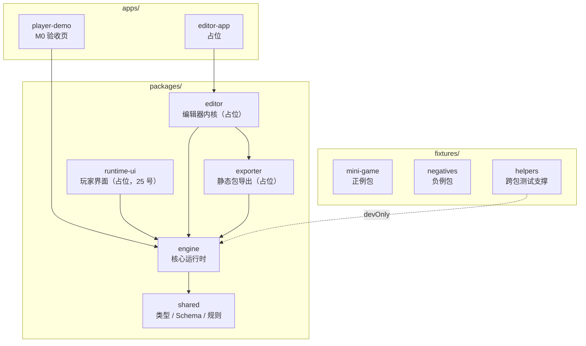
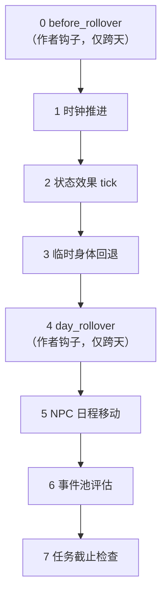
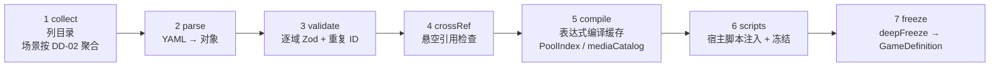
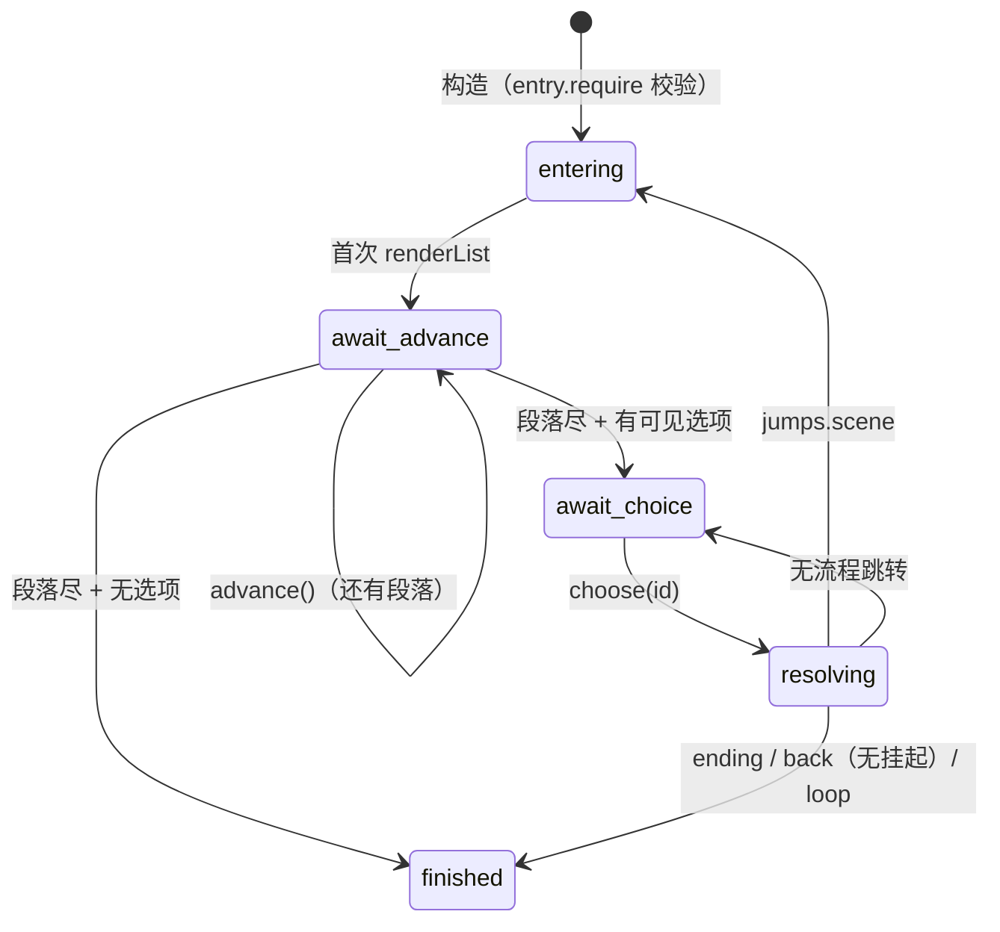
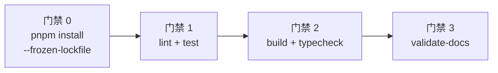

# 项目架构（as-built）


> **本文档是「已实现架构」的权威描述**：完整反映当前代码的逻辑架构，随代码变更同步更新（维护规则见文末）。
> 设计意图与决策依据见 `docs/detail-design.md`（引用格式 §x.y / DD-nn）；需求见 `docs/proposal.md`；进度见 `docs/tasks/progress.md`。
> 最后核对：2026-09-14，M1 进行中——09/10/11/12/13/14/22/24/25A 已合入（20 与 25 的 B/C 组进行中）。
>
## 写作规范（改动本文档前先读）

**这份文档的读者是「要改代码的人」，不是「要审计实现的人」。** 因此：


```
┌──────────────────────────── 仓库布局 ────────────────────────────┐
│ packages/shared      @game/shared     类型/Schema/规则单一来源     │
│ packages/engine      @game/engine     核心运行时（无 React/DOM）   │
│ packages/runtime-ui  @game/runtime-ui 玩家界面组件库（React，25A）  │
│ packages/editor      @game/editor     可视化编辑器（占位，26 号）   │
│ packages/exporter    @game/exporter   导出分发（占位，27 号）       │
│ apps/player-demo     player-demo      runtime-ui 宿主页（试玩）     │
│ apps/editor-app      editor-app       编辑器宿主页（占位）          │
│ fixtures/mini-game   正例游戏包夹具（约 60 个 YAML）                │
│ fixtures/negatives/  5 个单缺陷负例包（每包一个预期 ErrCode）        │
│ fixtures/helpers/    跨包测试夹具包（InMemoryPackageSource 等）      │
└──────────────────────────────────────────────────────────────────┘
>```

关键约束（后续各节反复出现）：

| 约束 | 含义 | 为什么 |
|---|---|---|
| engine 零平台依赖 | 不 import React，不碰 DOM/图像/音频 | 能在 Node 里全量单测；UI 可替换 |
| 状态只能经事务变更 | 所有写操作走 `exec`，immer 提交或回滚 | 回滚功能与存档一致性都靠它 |
| 子系统间禁横向 import | 只用「事务 + EngineEvent + 时间管线编排」交互（DD-06） | 否则依赖图会退化成网状 |
| 定义与状态分离 | `GameDefinition` 冻结只读；`GameState` 随事务演进 | 定义可多宿主共享；状态可序列化存档 |

---

## 2. 仓库与依赖规则



**依赖规则（ESLint flat config 强制，违反即 lint 红）：**

| 规则 | 内容 | 强制手段 |
|---|---|---|
| R1 | `shared` 零包依赖（仅放行 zod），是类型与规则的唯一来源 | `no-restricted-imports` + package.json |
| R2 | `engine` 只依赖 `shared`；禁 React、禁 DOM/BOM 全局（**src 与 test 同样适用**） | import 限制 + `no-restricted-globals` |
| R3 | 禁止深路径导入：包外只能 `import from '@game/<pkg>'` | eslint（各包 `src/index.ts` 是唯一出口） |
| R4 | `shared`/`engine` 源码禁裸 `throw new Error`，必须抛 `EngineError`（code/where/messageKey） | `no-restricted-syntax` |
| R5 | engine 子系统间禁横向 import（DD-06）：只用事务 / EngineEvent / 时间管线编排 | 目录出口约定 + review |


> R2 只约束 engine（25A 起 runtime-ui 是浏览器包：允许 React 与 DOM；其测试跑 jsdom，
> engine/shared 的测试仍在 node 环境——node 环境即「engine 无 DOM」的回归防线）。

```
mermaid 等价依赖图：
apps/* ──> runtime-ui ──> engine ──> shared
editor ──> exporter ──> engine/shared
engine 内部：loader → (state, effects, expr) ；narrative → (state, runtime, i18n)
content 为纯谓词子系统（仅依赖 shared，无横向 import）；narrative 经结构化最小接口注入，不 import content。
>```

**三个要点：**

1. **事务边界 = 一个 undo 点**。一次选项点击、一次时段推进、一次事件子会话，都是一个
   `exec`。任一步失败整批回滚，不会留下半成品状态。回滚栈由 `checkpoint()` 打点（栈深可配）。
2. **事件是唯一的外泄副作用**。指令不直接改 UI，而是 `emit` 事件；UI 经 `on(type, handler)`
   订阅。测试因此可以断言「事件序列」而不需要 UI。
3. **跳转与状态分离**。`goto`/`ending`/`battle` 这类指令只往 `ExecOutcome.jumps` 追加意图，
   不改状态；由 `SceneRunner` 或宿主消费。这让战斗/结局可从任意入口进入。

<details>
<summary><b>状态树结构（GameState，改状态时看这里）</b></summary>

```
GameState
├─ versions     三层版本 + engineVersion（FR-MIGR-01，入档）
├─ loop         周目数（FR-LOOP）
├─ player
│  ├─ attrs / skills / statuses          属性、技能、状态效果实例
│  ├─ derived                            派生属性缓存（读档后重算，不入档）
│  ├─ body / bodyTemp / bodyProgress     身体部位、临时变身、渐进变身（14 号）
│  ├─ equip / outfit / outfitPresets     装备栏、多层服装、换装预设（13 号）
│  ├─ bag / wallet                       背包、多货币
│  └─ bootstrap                          新档初始化产物（perks 等）
├─ world
│  ├─ time                               Clock（day/slotIndex/week/month）
│  ├─ unlockedAreas / flags / counters
│  ├─ npcLocationCache                   日程解析缓存（可重建，不入档）
│  └─ eventCooldowns                     事件冷却
├─ npcs / factions / quests              各实体状态
├─ seen                                  scenes / gallery / cg / endings / codex
├─ readStats                             用时、事件计数、判定与战斗统计
├─ settings                              PlayerSettings（语言/文本/媒体/过滤）
└─ checkpoints                           回滚栈元数据（负载存内存，不入档）
```

入档投影见 `packages/shared/src/schema/save.ts` 的 `serializedStateSchema`；
`npcLocationCache` 与 `checkpoints` 明确不入档，读档后重建。
</details>

<details>
<summary><b>时间推进的固定次序（DD-10，改动管线前必读）</b></summary>

一次 `advance(n)` = **一个** `exec` 事务 = 一个 undo 点。步骤次序固定，不可插入中间：



各步骤经 `TimePipelineOptions` 的**槽位钩子**注入（依赖模块挂载点），作者只能挂
`before_rollover` / `day_rollover` 两个前后缀位置。时钟写入本身是内部指令
`__time.advance`，作者包内不可达。

| 步骤 | 归属模块 | 挂载方式 |
|---|---|---|
| 2 状态 tick | 13 号物品 | `createItemTickProvider` → `__items.tick` |
| 3 身体回退 | 14 号身体 | `createBodyRevertProvider` → `__body.revert` |
| 5 NPC 日程 | 12 号 NPC | `createNpcScheduleProvider` → `__npc.resolve` |
| 6 事件评估 | 10 号事件 | `createEventStepProvider` → `__events.eval` |
| 7 任务截止 | 11 号任务 | `createQuestDeadlineProvider` → `__quest.deadline` |
</details>

---

## 4. 加载管线

游戏包（目录 / 静态 JSON / 编辑器内存）经**同一条**七步管线变成冻结的 `GameDefinition`：



- **错误分两级**：`error` 阻断加载并抛 `EngineError`；`warning` 进入 `definition.diagnostics`
  随包携带（编辑器校验中心复用同一规则集）。
- **引用类型驱动校验**（§2.1 `refKind` 元数据）：场景跳转/物品/NPC 引用缺失 → error；
  媒体/文本键缺失 → warning（运行期占位或回退显示原始键）。
- **`GameDefinition` 发布全部实体域**（scenes/areas/events/npcs/items/quests/shops/
  achievements/perks/endings/factions），宿主由此投影装配运行时的目录注入面。

> 快速定位：入口 `loader/pipeline.ts` 的 `loadGamePackage()`；每步一个文件
> （collect / parse / validate / cross-ref / compile / freeze / scripts）。

<details>
<summary><b>GameDefinition 的完整字段（写宿主接线时查）</b></summary>

```ts
interface GameDefinition {
  manifest; scenes; areas; events; npcs; items; quests; shops;
  achievements; perks; endings; factions;      // 全部实体域（Map 承载）
  poolIndex;          // 事件池索引：byScope / dirtyMap / mutexGroups
  exprCache;          // 全包表达式编译缓存（键 = 表达式原文）
  functionRegistry;   // 冻结后的表达式函数注册表（内置 20 + x.* 扩展）
  effectRegistry;     // 冻结的效果指令注册表 → GameRuntime 的 executor
  mediaCatalog;       // assetId → {path, hash, preload, type}
  time;               // TimeConfig（data/time.yaml，缺省 undefined）
  locales;            // 仅 manifest.langs 声明的语言
  redirects;          // manifest.redirects（迁移定向改写用）
  diagnostics;        // 仅 warning 级
}
```
</details>

---

## 5. engine 子系统

**24 个目录中 16 个有实现**（其余 8 个是空占位，对应 M2+ 模块，见 §5 末）。
下表是导航索引——想改什么，找对应行。

### 5.1 有实现的子系统

| 子系统 | 一句话职责 | 关键入口 | 模块 |
|---|---|---|---|
| [`state/`](../packages/engine/src/state/) | 状态树、新档初始化、派生属性重算、序列化 | `GameState` / `newGameState` / `recomputeDerived` | 04 |
| [`runtime/`](../packages/engine/src/runtime/) | **事务执行器**：immer draft → 提交/回滚；事件总线；回滚栈 | `GameRuntime.exec` / `checkpoint` / `on` | 04 |
| [`expr-eval/`](../packages/engine/src/expr-eval/) | 受限表达式语言：解析 → 编译 → 求值（AST 解释，禁 eval） | `parseExpr` / `compileExpr` / `evalExpr` | 03 |
| [`effects/`](../packages/engine/src/effects/) | 效果指令注册表 + 25 条作者可见指令 + 7 条内部指令 | `EffectRegistry` / `createBuiltinEffectRegistry` | 05 起 |
| [`loader/`](../packages/engine/src/loader/) | 七步加载管线（见 §4） | `loadGamePackage` | 06 |
| [`i18n/`](../packages/engine/src/i18n/) | 文本键解析、回退链、插值、变体 | `createTextResolver` | 07 |
| [`narrative/`](../packages/engine/src/narrative/) | 场景会话状态机：段落推进 / 选项 / 子会话栈 / 历史缓冲 | `SceneRunner` | 08 |
| [`time/`](../packages/engine/src/time/) | 时钟推进纯函数 + 固定次序推进管线（见 §3 折叠块） | `advanceClock` / `TimePipeline` | 09 |
| [`content/`](../packages/engine/src/content/) | 内容分级过滤谓词 + 占位回退 + 首启向导 | `ContentFilter` | 22 |
| [`items/`](../packages/engine/src/items/) | 背包纯函数集、装备修正、耐久 tick、背包投影 | `bagGive` / `projectBag` | 13 |
| [`quests/`](../packages/engine/src/quests/) | 任务六态状态机、阶段推进、奖励原子事务 | `QuestMachine` | 11 |
| [`npcs/`](../packages/engine/src/npcs/) | 日程解析（位置缓存）、好感/声望机制、关系投影 | `resolveNpcLocations` / `applyFavorChange` | 12 |
| [`body/`](../packages/engine/src/body/) | 身体部位、临时变身回退、代词注入 | `createBodyRevertProvider` | 14 |
| [`events/`](../packages/engine/src/events/) | 事件池四步评估（collect→prune→select→dispatch）+ 脏标记增量 | `EventPool` | 10 |
| [`media/`](../packages/engine/src/media/) | 媒体意图解析与资源存在性核对（零图像/音频依赖） | `MediaResolver` | 24 |
| [`persistence/`](../packages/engine/src/persistence/) | 存档服务：适配器契约、版本闸门、自动/快速存档 | `SaveService` / `MemoryAdapter` | 20 |

### 5.2 子系统详解（实现细节，按需展开）

<details>
<summary><b>state/ — 状态树与事务底座</b>（设计 §3.1，04 号）</summary>


## 4. runtime-ui 包（`packages/runtime-ui/src/`，25A 已落地）

React 通用游玩界面组件库（设计 §6）。**唯一允许 React/DOM 的包**（R2 只约束 engine）；
所有组件 props 受控、可 Testing Library 测；面板数据源一律为**纯投影函数**
（GameState/定义 → 视图），组件不做业务计算。

- **app/**：应用外壳与状态订阅（§6.2）
  - `store.ts`/`types.ts`：`createUiStore`（Zustand vanilla，每实例独立）——切片
    `screen` / `runtime` / `session` / `notifications` / `panels` / `statHighlights` /
    `questRevision`；`pushNotification` 是通知队列唯一写入口（写入即应用 500ms 合并）。
  - `bridgeRuntimeEvents`：引擎事件 → store 的订阅桥（stat_changed → 数值高亮、
    notify → Toast、quest_state_changed/quest_stage → 任务面板重算信号），返回退订句柄。
  - `selectors.ts` + `hooks.tsx`：纯 selector 集 + `UiStoreProvider` / `useUiSelector`
    （`useSyncExternalStore`）——未变更切片的引用保持稳定，实现 selector 级细粒度重渲染。
  - `AppShell.tsx`：≥900px 双栏 / 窄屏折叠 Tab（FR-UI-01/09，触控目标 ≥44px）。
  - `TitleScreen.tsx`：主菜单六项（FR-UI-06；无存档时禁用不隐藏）。
  - `game-host.ts`：**集成层**——`createGameHost` 把 `GameDefinition` 装配为可玩会话
    （GameRuntime + TimePipeline 步骤钩子 + SceneRunner 注入 + 面板投影），
    见本节末「宿主装配」。
- **text/**：文本渲染管线（§6.1）
  - `sanitize.ts`：白名单标签（`b/i/em/mark/ruby/span[class=tone-*]/br/hr`）+ 自写序列化，
    基于 `parse5` AST 产出纯数据节点树——**全流程无 innerHTML 路径**（NFR-18）；
    非白名单标签转义显示；注释节点丢弃。
  - `pipeline.ts`：`TextResolver.resolve`（插值归引擎）→ sanitize → 节点树 + 纯文本投影；
    进入 resolver 前对 vars 字符串叶子做实体转义（次序不变式：插值值永不引入标签）。
  - `RichText.tsx` / `typewriter.tsx`：节点树 → React 元素（`createElement`）；
    打字机只做**前缀裁剪**（`sliceRichTextNodes`，节点顺序与层级逐字保留），
    `prefers-reduced-motion` 命中时自动关闭（NFR-26）。
- **narrative/**：`NarrativeView` / `OptionList`（受控；打字机只作用于最后一段）；
  `checkpoint.ts` 提供 `createChoiceCheckpoint` / `withChoiceCheckpoint`（FR-READ-03）。
- **panels/**：`projectStatusPanel` + `StatusPanel`（五块内容 + 增量高亮，高亮走面板内部
  不占 Toast）、`projectAreaViews` + `MapPanel`（区域图/移动消耗/解锁提示原文）、
  `QuestLogPanel`（消费引擎 `projectQuestLog`，追踪条目置顶且不在分组内重复）。
- **notifications/**：`mergeToast` / `expireToasts`（纯函数：同类同键 500ms 窗口折叠、
  count 递增、超窗新起条）+ `ToastStack`（受控浮层）。
- **settings/**：`SettingsPanel`（PlayerSettings 表单化：语言/排版/媒体开关/减弱动画/
  标签开关/快捷键表/三版本号；标签开关只报告新 `disabledTags`）。
- **onboarding/**：`ContentWizard`（首启内容向导：警告页 + 标签开关；跳过同样提交
  当前开关态——避免默认关闭的标签被静默打开）。
- **persistence/**：`DexieAdapter`（IndexedDB 三表 saves/profile/kv；**原子写**在单
  Dexie 事务内同时落备份位与主档位）、`MemoryAdapter` + `selectAdapter`/`probeIndexedDb`
  （隐私模式降级，NFR-10）、`PrivacyBanner`（常驻导出提醒，刻意无关闭按钮）。
  契约（`PersistenceAdapter`/`SaveMeta`/`ProfileStore`）为**本地结构镜像**——20 号落地
  后改从 `@game/engine` 导入，适配器实现不变（TS 结构类型）。一处 as-built 偏差：
  §6.7 的「DexieAdapter implements PersistenceAdapter, ProfileStore」因两接口 `load`
  同名异签名无法在类上共存，改以组合暴露 `adapter.profile`。
- **测试**：`packages/runtime-ui/test/**` 在 **jsdom** 环境跑（其余包保持 node），
  setup 注册 jest-dom 断言与 `IS_REACT_ACT_ENVIRONMENT`；覆盖率阈值 80%。

### 宿主装配（`app/game-host.ts`）

`createGameHost({ definition, attrDefs?, contentTags?, initialAttrs?, seed? })` →
`{ store, runtime, start/advance/choose/rollback/moveTo, calendar/questLog/statusPanel/areas/
location, textOf, updateSettings, lastError }`。要点：

- `choose` 内**先 checkpoint 再执行**，失败即 `rollback(1)` 并把错误转为 `lastError`
  （不抛给 React）；`rollback` 后按 §6.3 重建会话。
- 位置语义：引擎状态树无「当前地点」字段（`world.unlockedAreas` 仅区域解锁），宿主以
  `currentLocation` 维护，供地图高亮与移动消耗（`moveTo` 经时间管线推进）。
- 两处 as-built 补偿（均为 06 号**导出面缺口**，宿主以公开构造器补齐，未改 engine 内部）：
  ① `GameDefinition` 未发布 `attrs` / `contentTags` → 由宿主以选项显式注入；
  ② 加载器产出的效果注册表未注入 `timeConfig`（`__time.advance` 会 EFFECT_FAILED）→
  宿主以 `createBuiltinEffectRegistry({ ..., timeConfig })` 重新装配。
- 设置写入：指令集无写 `settings` 的指令，宿主以镜像持有并提供 `updateSettings`
  （`disabledTags` 变更同时重建会话使过滤即时生效）；20 号 SaveService 落地后改经其合并。

## 5. 应用层（apps/）

- **player-demo**（`src/main.tsx`）：**runtime-ui 宿主页**（React）。页面只做三件事：
  Vite `import.meta.glob(?raw)` 读 fixtures/mini-game → 解析 attrs/content-tags 并
  `createGameHost` 装配 → 挂 React 根并组装组件树（AppShell + NarrativeView +
  OptionList + 三面板 + 向导 + Toast + 设置抽屉）。渲染与交互逻辑全部在 runtime-ui 包内。
  M0 时期的 vanilla TS 接线参考已由本形态取代。
- **editor-app**：占位页（26 号）。

## 6. 测试体系

- 位置约定（vitest）：`packages/<pkg>/test/**/*.test.ts(x)`；workspace 包经 vitest alias
  解析到**源码**（CI 不构建 dist）。
- **环境分区**（25A 起）：`projects` 分两个项目——`node`（shared/engine/editor/exporter
  与 fixtures/helpers）与 `dom`（runtime-ui，jsdom + testing-library setup）。Vitest 5 已移除
  `environmentMatchGlobs`，按路径分区改用 `projects`。engine 的「无 DOM」由 node 环境回归。
- 组织：engine/test 按子系统分目录（expr-eval、effects、loader、i18n、narrative、content、
  runtime、state、time、items、quests、npcs、body、events、smoke）、media；shared/test 按
  schema + 基础；runtime-ui/test 按切片分目录（app / text / narrative / panels / notifications /
  settings / persistence / onboarding / acceptance）。每目录有 `fixtures.ts` 局部夹具；
  跨包夹具在 fixtures/helpers 包。
- 规模（25A 入库后）：152 个测试文件 / 2214 个用例全绿。
- 覆盖率门禁（v8）：shared ≥ 90%，engine ≥ 80%，runtime-ui ≥ 80%。

## 7. 质量门禁与工具链
>
| 分组 | 指令 | 文件 |
|---|---|---|
| 状态 | `set` `add` `flag` `money` | `state.ts` |
| 物品 | `give` `take` `equip` `unequip` `wear` `remove` | `items.ts` |
| 关系 | `favor` `reputation` | `relations.ts` |
| 流程跳转 | `goto` `back` `ending` `loop_transition` | `flow.ts` |
| 系统 | `advance_time` `quest` `unlock` `notify` `media` | `system.ts` |
| 判定/战斗/身体 | `check` `battle` `set_body` | `adversarial.ts` |
| 扩展 | `call`（DD-08） | `util.ts` |


## 8. 维护规则（随代码变更更新本文档）
>
<details>
<summary><b>loader/ — 七步管线</b>（设计 §3.4，06 号）</summary>

一文件一步：`collect.ts` → `parse.ts` → `validate.ts` → `cross-ref.ts` → `compile.ts` →
`scripts.ts` → `freeze.ts`，由 `pipeline.ts` 串联。

- `source-memory.ts`：`InMemoryPackageSource`（`Record<path, content>` 构造），三宿主
  共用的包源抽象之一。
- `walk.ts`：schema 元数据驱动的包内容盘点（refKind 引用位点 / exprSchema 表达式位点 /
  call 指令位点），单遍遍历，结果供 crossRef / compile / scripts 三方消费。
- `compile.ts` 另建 `PoolIndex`（byScope / dirtyMap / mutexGroups / questRefs /
  achievementRefs）与 `mediaCatalog`（FNV-1a 内容指纹）。
</details>

<details>
<summary><b>narrative/ — 叙事运行时</b>（设计 §4.2，08 号）</summary>

- `scene-runner.ts`：`SceneRunner` 五相位状态机
  （`entering → await_advance → await_choice → resolving → finished`）。



  - `SUBSESSION_DEPTH_LIMIT = 3`：事件场景子会话挂起栈，超限发 warning。
  - `NARRATIVE_HISTORY_CAPACITY = 500`：环形历史缓冲（回看数据源）。
  - `readonly` 会话：回想重放，不写 `seen`、无任何副作用。
  - 注入缝：`contentFilter`（22 号）/ `mediaResolver` + `evalSpriteCondition`（24 号）/
    `def.npcs` + `def.areas`（立绘差分与区域媒体回落）。
- `macros.ts`：三类叙事宏（`first`/`again` 首访差异、`if` 条件、`random` 随机），
  在 `renderList` 惰性展开，按访问快照缓存。
</details>

<details>
<summary><b>time/ — 时间系统与推进管线</b>（设计 §4.3，09 号）</summary>

- `clock.ts`：`advanceClock()` 纯函数（slot → day → week → month 递进，返回跨天/跨周/跨月
  旗标）；`weekdayIndex()` / `dayOfMonth()`；`DEFAULT_TIME_CONFIG`（4 时段 × 7 天）。
- `calendar.ts`：`projectCalendar()` 日历 UI 投影；`createTimeViewProvider()` 求值视图校准。
- `pipeline.ts`：`TimePipeline.advance(slots)` 固定次序编排（§3 折叠块有图）。
</details>

<details>
<summary><b>events/ — 事件系统</b>（设计 §4.4，10 号）</summary>

- `evaluator.ts`：四步纯函数——`collectCandidates`（作用域 + 静态窗口过滤）→
  `pruneCandidates`（冷却 + 内容过滤）→ `selectCandidates`（priority 降序 / 权重随机 +
  互斥组）→ `exploreCandidates`（探索发现型子池）。
- `pool.ts`：`EventPool` 编排四步 + **脏标记增量**（`dirtyMap` 经 `ref-paths.ts` 归一化，
  未命中事件零求值，NFR-02）。冷却是**返回值**而非原地写（状态冻结），由事务 draft 应用。
- `instruction.ts` / `step.ts`：`__events.eval` 内部指令与时间管线步骤 6 挂载。
- 错过窗口不排队（FR-XPLR-06 设计裁决，作者用 condition + flag 实现预约式剧情）。
</details>

<details>
<summary><b>quests/ — 任务系统</b>（设计 §4.5，11 号）</summary>

- `quest-machine.ts`：`QuestMachine` 六态状态机 + `TransactionDeriver` 接入点。
- `transitions.ts`：`QUEST_STATES` / `QUEST_TRANSITIONS` / `assertTransition` / `canTransition`
  ——合法迁移表的唯一来源。
- `deriver.ts`：`createQuestDeriver`——事务后按触碰路径推进引用该路径的任务（脏标记）。
- `deadline.ts`：`createQuestDeadlineProvider` → 时间管线步骤 7（`failWhen` 全量判定）。
- `projection.ts`：`projectQuestLog` 任务日志投影（分组/追踪上限）。
</details>

<details>
<summary><b>npcs/ — NPC 与阵营</b>（设计 §4.6，12 号）</summary>

- `schedule.ts`：`resolveNpcLocation(s)` 日程解析（按声明序取首个匹配；无匹配 = 不在场）。
- `deriver.ts`：`createNpcScheduleDeriver`——日程缓存维护（脏标记：时间/flag/解锁变化时重建）。
- `favor.ts` / `reputation.ts` / `thresholds.ts`：好感与声望的 clamp、阶段/波段阈值二分、
  变化时 emit 事件。
- `projection.ts`：`projectRelationships` 关系面板投影。
</details>

<details>
<summary><b>items/ — 物品与装备</b>（设计 §4.7，13 号）</summary>

- `inventory.ts`：`bagGive` / `bagTake` / `bagCount` / `bagSplit` / `bagMerge` 纯函数集
  （堆叠封顶、容量按条目数、失败统一 `EFFECT_FAILED`）。
- `equip.ts`：`equipModDetails()` 装备修正明细投影（面板数据源）。
- `tick.ts`：`createItemTickProvider` → 管线步骤 2（时效按穿着时段、耐久按跨天递减，
  触发 `item_expired` 后清除 wornMeta，引擎不自动脱下）。
- `projection.ts`：`projectBag()` 背包 UI 投影（按种类聚合、关键道具分区、搜索）。
- 换装预设存 `player.outfitPresets`（设计偏差：§4.7 原定 world.flags，但 flag 值域仅标量）。
</details>

<details>
<summary><b>body/ — 身体与变身</b>（设计 §4.8，14 号）</summary>

- `tick.ts`：`createBodyRevertProvider` → 管线步骤 3（`bodyTemp` 为空时短路）。
- `pronouns.ts`：`createPronounInjector` 代词注入（`player.they/them/their`），
  partial mapping 容错。
</details>

<details>
<summary><b>content/ — 内容分级与过滤</b>（设计 §5.8，22 号）</summary>

- `filter.ts`：`ContentFilter` 三谓词（`passes` / `placeholderFor` / …），单点判定，
  注入式消费（narrative / events / 选项三处应用点复用同一实例）。
- `wizard.ts`：`resolveContentWizard` 首启向导信息（从 manifest.contentWarning 读取）。
</details>

<details>
<summary><b>media/ — 媒体解析（引擎侧）</b>（设计 §5.10，24 号）</summary>

- `resolver.ts`：`MediaResolver` 只做两件事——查 `mediaCatalog` 核对 assetId 存在性、
  给缺失资源补 `missing: true` 占位标记（`decorate()`）。意图形态归调用方决定，避免
  语义在解析器里分叉。告警按 assetId 去重；`lookup()` 为免告警查询。
- **intent 流**：场景级 bg/bgm 进场景时产出（场景声明优先、逐项回落区域绑定）；
  段落级 cg/sprite 随段落**揭示**产出（未揭示不产出），CG 揭示即登记 `seen.cg`。
  段落级媒体挂在文本段落自身，intent 序 cg 在前 sprite 在后。
- **依赖缝**：narrative 与 effects 都不 import 本子系统，各自声明结构化最小视图
  （`NarrativeMediaResolver` / `EffectRegistryOptions.mediaResolver`）。
</details>

<details>
<summary><b>persistence/ — 存档服务</b>（设计 §5.6，20 号）</summary>

- `types.ts`：`PersistenceAdapter` 契约（listSaves / load / write / remove / rename /
  loadBackup）与 `SaveMeta`。**依赖倒置（DD-04）**：engine 只定义接口。
- `memory-adapter.ts`：`MemoryAdapter`——写前旧档入备份位（FR-SAVE-05 原子写）、写失败
  注入缝（`beforeWrite` 模拟 quota）、存取深拷贝隔离；供测试基座与浏览器隐私模式降级
  两用。`projectSaveMeta()` 为 blob → 元信息投影。
- `service.ts`：`SaveService`——`save` 组装 SaveBlob；`load` 版本闸门
  （高版本 → `VERSION_UNSUPPORTED` 且**不触碰运行时**；低版本 → 注入的 `migrate` 入口，
  21 号接入点；相等 → Zod 终验 → `runtime.restore`）；`autosave` 三点触发 +
  `auto_1..3` 环形轮换；`quicksave/quickload` 独立 `quick` 槽；`exportSlot/importSlot`
  JSON 往返；`restoreBackup` 备份救援。写失败统一包装 `SAVE_CORRUPT`（保留 cause）。
- **契约套件**：`fixtures/helpers/src/persistence-contract.ts`——跨包共用，
  25 号 DexieAdapter 在此追加一行即可复用全套 14 条用例。
</details>

### 5.3 空占位子系统（M2+ 待实现）

`achievements/`（18 号）、`battle/`（16 号）、`checks/`（15 号）、`economy/`（17 号）、
`loop/`（19 号）、`migration/`（21 号）、`scripts/`（23 号）——均为空目录（仅 `.gitkeep`），
模块开工时填充。

---

## 6. shared / apps / fixtures

| 位置 | 内容 | 备注 |
|---|---|---|
| `shared/src/ids.ts` | `GameId` / `Lang` / `TextKey` / `RefKind`、`refId()`、`GAME_ID_PATTERN` | 全库 ID 规范源头 |
| `shared/src/errors.ts` | `EngineError`（code/where/messageKey 三元组）、`ErrCode` | 全库唯一异常类型 |
| `shared/src/expr.ts` | 表达式语言规格类型（`ExprNode` / `CompiledExpr` / `EvalContext` 等） | engine/expr-eval 按此实现 |
| `shared/src/rng.ts` | `createRng` / `Rng`（状态可序列化） | 注入式随机，回放一致性根基 |
| `shared/src/schema/` | 23 个数据域的 Zod schema | 兼作 JSON Schema 快照基线 |
| `shared/src/validation/` | 跨域校验辅助 | |
| `apps/player-demo` | M0 验收页（vanilla TS） | 接线参考：glob 读包 → 加载 → 运行时 → 渲染 |
| `fixtures/mini-game` | 正例游戏包（1 区域 / 5 场景 / 2 事件 / 1 任务 / 2 NPC） | 全部测试共享 |
| `fixtures/negatives` | 负例包（每包一个预期 `ErrCode`） | 管线校验的回归夹具 |
| `fixtures/helpers` | 跨包测试支撑（`InMemoryPackageSource` / 适配器契约套件） | R2 约束下的跨包测试唯一去处 |

---

## 7. 测试与质量门禁

### 7.1 测试布局

- 位置：`packages/<pkg>/test/**/*.test.ts`；workspace 包经 vitest alias 解析到**源码**
  （不是 dist），保证跨包导入与包内导入共用同一模块实例。
- 组织：engine 按子系统分目录，每目录配 `fixtures.ts` 局部夹具；跨包夹具在
  `fixtures/helpers`（由该包自己的 test 运行，因为 R2 禁止 engine 测试 import 它）。
- 规模（20 号入库后）：**130 个测试文件 / 2011 个用例**。
- 实测覆盖率：语句 **94.26%**、分支 **86.08%**、函数 **96.28%**、行 **95.55%**。

### 7.2 CI 四道门禁



| # | 命令 | 内容 |
|---|---|---|
| 0 | `pnpm install --frozen-lockfile` | 锁文件一致性 |
| 1 | `pnpm -w lint && pnpm -w test` | eslint（R1–R5 + 依赖规则）+ prettier check；全量单元测试 |
| 2 | `pnpm -w build && pnpm -w typecheck` | 递归构建 + 全仓类型检查 |
| 3 | `node scripts/validate-docs.mjs` | 文档一致性（编号交叉引用 / 任务登记 / **架构文档与代码结构一致** / 归档标注） |

**覆盖率门禁**（v8，`vitest.config.ts`）：shared ≥ 90%、engine ≥ 80%（四指标）。本地用
`pnpm test:coverage` 查看——`pnpm test` 不带覆盖率统计。

### 7.3 本地验证须知

从 `packages/<pkg>/` 目录内直接跑 vitest 会解析到 `dist`（构建产物，不入库）而非源码，
产生假失败。**统一从仓库根跑**：

```bash
pnpm exec vitest run --root .                    # 全量
pnpm exec vitest run --root . packages/engine     # 限定范围
```

---

## 8. 维护规则

发生以下任一变更时，**同一 PR 内**必须更新本文档对应小节（约束见 `develop.md` 约束 4）：

| 变更 | 必须更新 |
|---|---|

| 新增/变更包或目录 | §1 布局与依赖规则 |
| shared 新增/变更类型域或 Schema | §2 |
| engine 新增/变更子系统、核心类型、导出面 | §3 对应小节（必要时 §1 依赖图） |
| runtime-ui 新增/变更切片、组件契约、宿主装配 | §4 runtime-ui 包 |
| 新增/删除效果指令 | §3.4 指令清单 |
| 加载管线步骤增删或次序调整 | §3.5 管线图 |
| 新增应用（apps）或数据流 | §5 应用层 |
| 测试组织/覆盖率门禁变化 | §6 测试体系 |
| CI/lint/文档门禁变化 | §7 质量门禁与工具链 |
>
写作规范与变更流程见文首（**改动本文档前先读**——放在文首而非这里，是为了让打开文件的
人第一时间看到，而不是读完 500 行才发现）。
