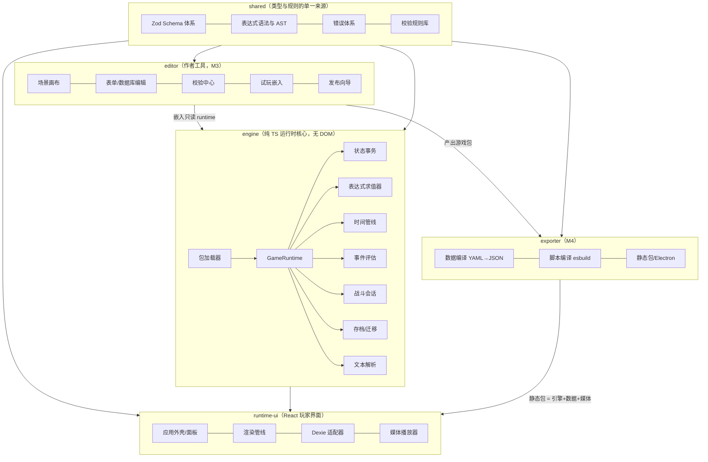
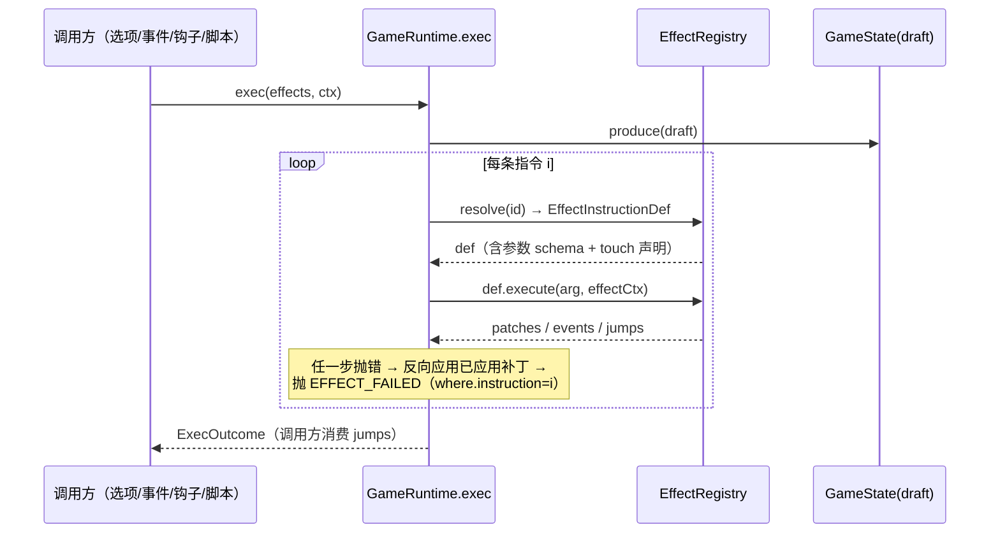
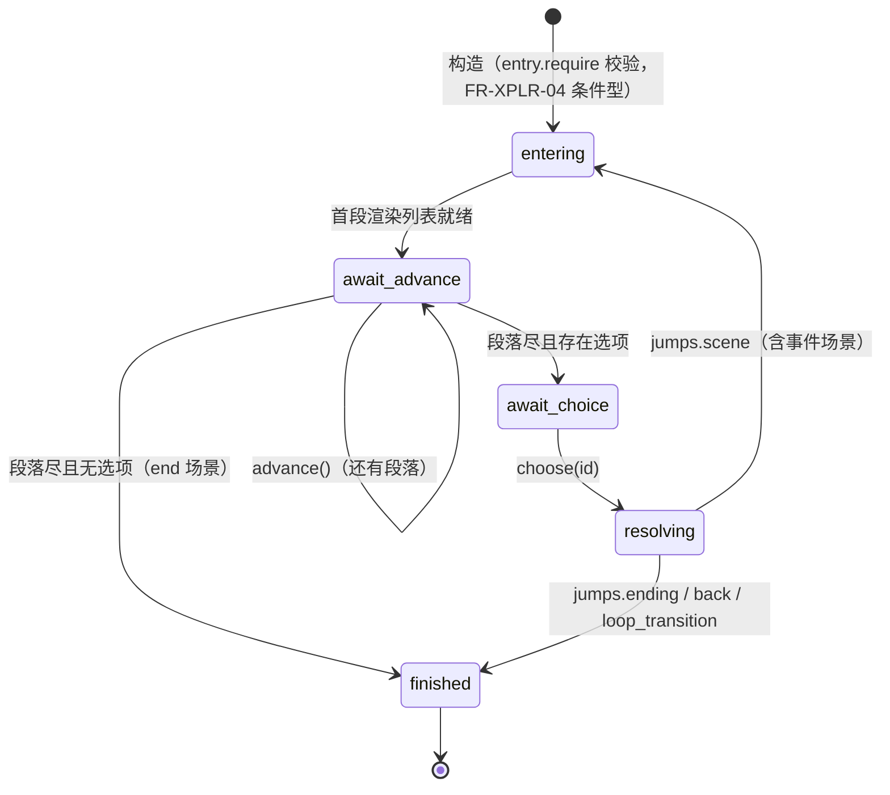
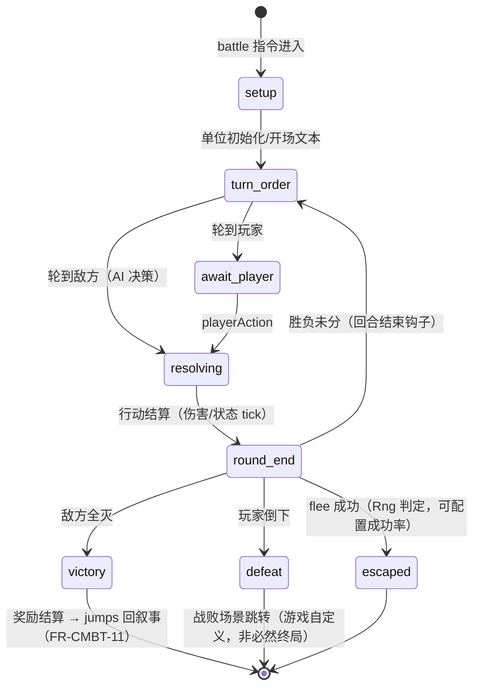
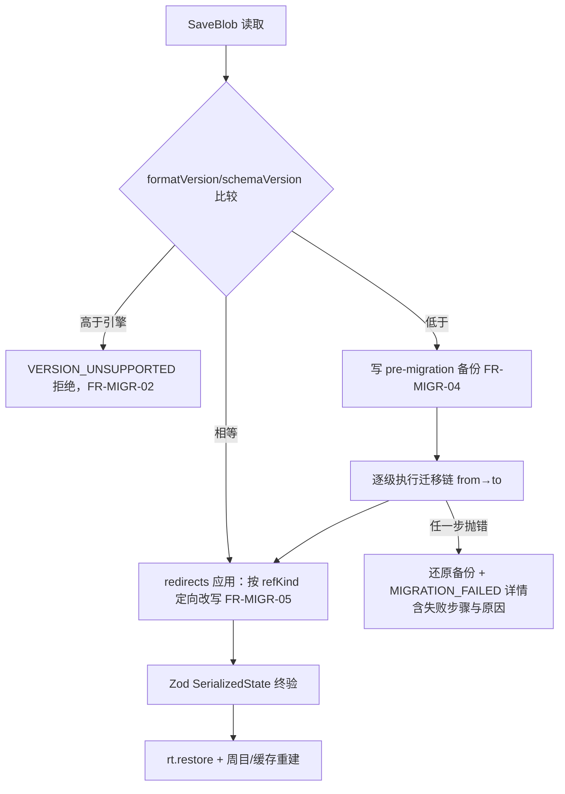
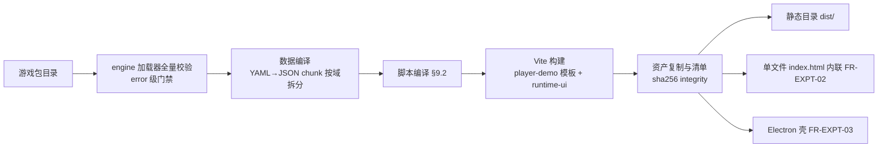

# 文字 RPG 冒险游戏引擎 详细设计文档

| 项目 | 内容 |
|---|---|
| 输入文档 | docs/proposal.md（需求文档 v1.2） |
| 文档版本 | v1.0 |
| 文档状态 | 设计基线 |
| 创建日期 | 2026-09-10 |
| 技术基线 | React 18 + TypeScript 5 + pnpm monorepo，纯前端，无后端 |

## 本文件的地位与改动流程

> **本文件是设计的唯一权威来源**：`DD-01～DD-12`（设计决策）与各节 `§x.y`（接口签名、状态机、
> 模块测试策略）只在此定义；架构文档、任务书引用时标 `§x.y` / `DD-nn` 指回本文件，不重述。
>
> **改动流程**（`develop.md` 约束 1）：设计变更**必须先改本文件并单独提交**，再落实现代码。
> 实现中若发现设计有更优解 → 先提出并修订本文件（说明理由），**不允许擅自改方向后补文档**。
>
> **冲突裁决**：本文件优先级高于 `architecture.md`（as-built 描述）与 `tasks/*`；与需求
> （`proposal.md`）冲突时以需求为准，并回到本文件同步修订。
>
> **编号纪律**：`validate-docs.mjs` 校验全仓引用的 DD 编号都在 §0 决策表登记、每个 FR 模块
> 至少被本文件引用一次（保证设计无遗漏）。

---

## 目录

- 0. 设计决策记录（DD）
- 1. 系统总体设计
- 2. shared 包设计（类型 / 错误 / 表达式 / Schema / RNG）
- 3. engine 包：核心运行时（事务 / 求值器 / 效果指令 / 加载器）
- 4. engine 包：世界与叙事系统（i18n / 叙事 / 时间 / 事件 / 任务 / NPC / 物品 / 身体）
- 5. engine 包：对抗、进度与外围（判定 / 战斗 / 经济 / 成就 / 周目 / 存档 / 迁移 / 过滤 / 脚本 / 媒体）
- 6. runtime-ui 包设计
- 7. editor 包设计
- 8. P2 功能包设计
- 9. exporter 包设计
- 10. 横切设计（测试策略 / 错误与日志 / 性能 / 目录结构）
- 11. 里程碑映射与需求追溯

> 阅读约定：每节开头以【FR-XXX】标注对应的需求模块；接口签名均为 TypeScript；每节末尾「独立测试」给出该模块的测试策略（模块间可独立测试是本文档的硬性设计要求）。

---

## 0. 设计决策记录（DD）

本章登记详细设计阶段做出的、影响多模块的决策。与需求文档 §0 的 D 决策（需求级）区分：DD 是设计级裁决，变更需评审。

| # | 决策 | 内容 | 关闭的开放问题 | 影响章节 |
|---|---|---|---|---|
| DD-01 | 表达式 v1 规格与错误语义 | 函数白名单冻结为 20 个（§2.3 表格为规范清单；2026-09-12 勘误：原文误计 18）；编译期未知变量/函数/参数即报错阻断加载；运行期严格抛错（含除零），由指令执行器定位到「场景+指令序号」。OQ-01 关闭 | OQ-01 | §2.3、§3.2 |
| DD-02 | 场景数据文件粒度 | `data/scenes/<areaId>/<sceneId>.yaml` 一场景一文件：Git diff 干净、编辑器并发写安全、加载器按目录聚合。OQ-02 关闭 | OQ-02 | §3.4 |
| DD-03 | 编辑器工作区形态 | 直接读写游戏包文件目录（经 FSAdapter 抽象），不引入 IndexedDB 工作区；浏览器降级为 File System Access API，再降级为只读目录 + 导出 zip。OQ-03 关闭 | OQ-03 | §7.2 |
| DD-04 | 持久化依赖倒置 | engine 仅定义 `PersistenceAdapter` / `ProfileStore` 接口；Dexie（IndexedDB）实现在 runtime-ui。engine 保持无 DOM、可在 Node 中以内存适配器单测 | — | §5.6、§6.7 |
| DD-05 | 媒体解耦 | engine 不接触音频/图像：只产出 `MediaIntent`（资源 ID + 控制语义），由 runtime-ui 的播放器消费。引擎可在无媒体环境测试 | — | §5.10、§6.8 |
| DD-06 | 子系统交互规则 | engine 内各子系统**禁止横向 import 调用**，只允许：① 经事务修改 GameState；② 发布/订阅 EngineEvent；③ 由时间管线（§4.3）按固定顺序编排。这是「模块可独立测试」的结构保证 | — | §1.3、§4.3 |
| DD-07 | 版本号粒度 | 整个游戏包单一 `schemaVersion` 递增（不按数据域拆分），迁移以存档为整体单位，避免跨域组合爆炸 | — | §5.7 |
| DD-08 | 作者扩展命名空间 | 脚本注册的效果指令 ID 必须 `x.<scriptId>.<name>`；数据中以 `{call: "x.festival.calendar", with: {...}}` 调用。与内置指令（约 20 个固定 ID）无冲突 | — | §3.3、§5.9 |
| DD-09 | 可注入种子 RNG | 所有随机（骰子/事件/掉落）经注入的 `Rng` 接口（§2.5），默认 mulberry32；RNG 状态随存档保存：测试可复现、回滚一致、同种子可回放、换节点不可预判刷随机 | — | §2.5 |
| DD-10 | 管线与迁移的固定次序 | 时段推进钩子顺序固定并写入文档（§4.3）；读档流程固定为「校验 → 迁移 → redirects 应用 → Zod 终验 → 周目状态恢复」，杜绝组合状态错乱（对应需求风险 R-05） | — | §4.3、§5.7 |
| DD-11 | 战斗会话隔离 | 战斗是独立 `BattleSession` 状态机（§5.2），与叙事仅通过效果指令进出与结果跳转耦合（OQ-04 的「嵌入面板」形态由 UI 层实现，不影响该边界） | OQ-04（UI 形态部分） | §5.2 |
| DD-12 | 校验即管线 | 校验规则（Rule）定义在 shared/validation，加载器运行其中 error 级子集（阻断加载），编辑器校验中心运行全量。规则只有一份，编辑器与运行时永不漂移 | — | §3.4、§7.7 |

---

## 1. 系统总体设计

### 1.1 架构总览



数据流：编辑器产出游戏包（`data/ + locales/ + assets/ + manifest`）→ exporter 编译 → 静态包 → 运行时由 engine 加载、驱动状态机 → runtime-ui 渲染与交互。

### 1.2 包依赖规则

| 规则 | 内容 |
|---|---|
| R1 | `shared` 不依赖任何其他包 |
| R2 | `engine` 只依赖 `shared`；禁止 import React / DOM API（CI 用 lint 规则强制：`no-restricted-imports` + 环境探测测试） |
| R3 | `runtime-ui` 依赖 `engine` + `shared`；不直接读游戏包文件（一律经 engine 加载产物） |
| R4 | `editor` 依赖全部包（含嵌入 runtime 预览）；`exporter` 依赖 `engine`（复用加载器做发布前校验）与 `shared` |
| R5 | engine 内子系统遵循 DD-06：无横向依赖，仅「事务 + 事件 + 管线编排」三种交互 |

### 1.3 可测试性设计原则（全文硬约束）

每个模块的设计必须给出**不依赖其他运行模块**的测试路径，达成手段：

1. **状态注入**：所有子系统只接触 `GameState`（纯数据）与 `EffectContext`，测试直接构造状态对象。
2. **随机注入**：DD-09 的 `Rng` 接口注入固定种子 → 骰子/事件/掉落确定性断言。
3. **持久化倒置**：DD-04 接口注入内存实现 → 存档/迁移测试无 IndexedDB。
4. **时间注入**：时间系统只被显式 `advance()` 驱动，无真实时钟依赖。
5. **事件边界**：子系统副作用以 `EngineEvent` 表达，测试断言事件序列而非 UI 效果。
6. **夹具游戏包**：仓库维护 `fixtures/mini-game/`（3 区域 / 8 场景 / 2 任务 / 4 事件 / 1 商店 / 3 成就 / 1 敌人）作为所有加载器与运行时测试的公共夹具。

### 1.4 模块清单与独立性索引

| 设计节 | 模块 | 对应需求 | 独立测试的隔离缝 |
|---|---|---|---|
| §3.1 | 状态事务 GameRuntime | FR-READ-03、FR-DEBG | 纯数据 + immer |
| §3.2 | 表达式求值器 | FR-NARR、DD-01 | 纯函数 |
| §3.3 | 效果指令系统 | FR-NARR-03、DD-08 | 注册表 + 注入 ctx |
| §3.4 | 包加载器 | FR-MIGR、DD-02/07/12 | 夹具文件系统 |
| §4.1 | 文本与本地化 | FR-L10N | 纯函数 + 词典夹具 |
| §4.2 | 叙事运行时 | FR-NARR、FR-XPLR | 桩化效果执行 |
| §4.3 | 时间系统 | FR-TIME | 显式 advance 驱动 |
| §4.4 | 事件系统 | FR-XPLR | 注入 rng + 状态 |
| §4.5 | 任务系统 | FR-QUEST | 状态订阅断言 |
| §4.6 | NPC / 阵营 | FR-NPCR | 纯数据 |
| §4.7 | 物品 / 服装 | FR-ITEM | 纯数据 |
| §4.8 | 身体与变身 | FR-BODY | 纯数据 |
| §5.1 | 判定系统 | FR-CMBT-01～06 | 注入 rng |
| §5.2 | 战斗系统 | FR-CMBT-07～13 | 会话级单测（DD-11） |
| §5.3 | 经济与商店 | FR-ECON | 表达式 + 事务 |
| §5.4 | 成就 / Profile | FR-ACHV | 事件流断言 |
| §5.5 | 周目系统 | FR-LOOP | 纯数据变换 |
| §5.6 | 存档服务 | FR-SAVE、DD-04 | 内存适配器 |
| §5.7 | 迁移引擎 | FR-MIGR、DD-07/10 | 旧档夹具矩阵 |
| §5.8 | 内容过滤 | FR-CGRD | 纯谓词 |
| §5.9 | 作者脚本宿主 | FR-SCR | 预编译模块桩 |
| §5.10 | 媒体解析 | FR-MEDIA、DD-05 | 事件断言 |
| §6 | runtime-ui | FR-UI、FR-READ 等 | Testing Library |
| §7 | editor | FR-EDTR | 组件测试 + 规则单测 |
| §8 | P2 功能包 | FR-XTRA | 各自带夹具 |
| §9 | exporter | FR-EXPT | 产物断言（E2E） |

---

## 2. shared 包设计

对应需求：全部模块的类型基础（D3、§4.5）。shared 包零运行时依赖（仅 zod），被其余四包共享。

### 2.1 ID 与基础类型

```ts
// shared/src/ids.ts
/** 游戏内容 ID：场景/物品/NPC/任务/成就等主键。仅 [a-z][a-z0-9_]*，加载期唯一性校验 */
export type GameId = string;
/** 文本键：命名空间路径，如 'npc.raven.greet' */
export type TextKey = string;
/** 语言代码 BCP-47，如 'zh-CN' */
export type Lang = string;
/** 表达式原文（编译后为 CompiledExpr） */
export type ExprSource = string;

/** 实体引用标记：schema 元数据用，迁移 redirects 按 kind 定向改写（§5.7） */
export type RefKind = 'scene' | 'item' | 'npc' | 'quest' | 'achievement' | 'faction' | 'area' | 'location' | 'media' | 'text';
```

约定：所有跨存档引用字段在 schema 中以 `refId(RefKind)` 辅助器声明（内部 = `z.string().meta({ refKind })`），加载器据此建索引、迁移器据此改写（DD-07 配套）。

### 2.2 错误体系

```ts
// shared/src/errors.ts
export type ErrCode =
  | 'SCHEMA_INVALID' | 'DUP_ID' | 'DANGLING_REF' | 'EXPR_COMPILE'
  | 'EVAL_ERROR' | 'EFFECT_FAILED' | 'MIGRATION_FAILED' | 'VERSION_UNSUPPORTED'
  | 'SAVE_CORRUPT' | 'MEDIA_MISSING' | 'SCRIPT_CONTRACT' | 'INTERNAL';

export interface EngineError extends Error {
  code: ErrCode;
  /** 定位信息：场景/文件/指令序号/表达式原文等 */
  where: Record<string, string>;
  /** 用户可读诊断（i18n 键），UI 显示用 */
  messageKey: TextKey;
  cause?: unknown;
}
```

原则（NFR-23）：错误必须携带 `code + where + messageKey` 三元组；禁止裸 `throw new Error()`（lint 规则强制）。诊断显示与日志规范见 §10.2。

### 2.3 表达式语言规格【DD-01，OQ-01 关闭】

**语法（EBNF）**：

```
expr        = ternary ;
ternary     = logicOr [ '?' expr ':' expr ] ;
logicOr     = logicAnd { '||' logicAnd } ;
logicAnd    = equality { '&&' equality } ;
equality    = comparison { ('==' | '!=') comparison } ;
comparison  = additive { ('<' | '<=' | '>' | '>=') additive } ;
additive    = multiplicative { ('+' | '-') multiplicative } ;
multiplicative = unary { ('*' | '/' | '%') unary } ;
unary       = ( '!' | '-' | '+' ) unary | primary ;
primary     = NUMBER | STRING | 'true' | 'false' | 'null'
            | path | call | '(' expr ')' ;
path        = IDENT { '.' IDENT } ;
call        = IDENT '(' [ expr { ',' expr } ] ')' ;
```

**AST 与编译产物**：

```ts
// shared/src/expr.ts
export type ExprNode =
  | { kind: 'num'; value: number } | { kind: 'str'; value: string }
  | { kind: 'bool'; value: boolean } | { kind: 'null' }
  | { kind: 'path'; segments: string[] }
  | { kind: 'call'; name: string; args: ExprNode[] }
  | { kind: 'unary'; op: '!' | '-' | '+'; operand: ExprNode }
  | { kind: 'binary'; op: '+' | '-' | '*' | '/' | '%' | '==' | '!=' | '<' | '<=' | '>' | '>=' | '&&' | '||'; left: ExprNode; right: ExprNode }
  | { kind: 'cond'; test: ExprNode; then: ExprNode; else: ExprNode };

export interface VarRef { root: string; path: string }   // 依赖索引键（§4.4 脏标记用）
export interface CompiledExpr {
  source: ExprSource;
  ast: ExprNode;
  refs: VarRef[];              // 编译期抽取，供事件池/成就做增量求值（DD-06）
}
export interface ExprFunctionDef {
  name: string;                // 内置名或 'x.<script>.<name>'（DD-08）
  arity: [number, number];     // [min, max]
  pure: boolean;               // pure=false 的函数不可出现在事件 require 中（防止缓存失效）
  fn: (args: unknown[], ctx: EvalContext) => unknown;
}
```

**变量域白名单**（root 命名空间，编译期校验）：

| root | 解析目标 |
|---|---|
| `attr` / `skill` | `state.player.attrs / skills` |
| `flag` | `state.world.flags` |
| `item` | 物品目录（`item.gold.count` 语法糖） |
| `outfit` / `body` | `state.player.outfit / body` |
| `npc` | `state.npcs[id]`（`.favor` / `.stage` / `.met` / 自定义 flag） |
| `faction` | `state.factions` |
| `time` | `state.world.time`（`.day` / `.weekday` / `.slot`） |
| `loop` | `state.loop` |
| `meta` | Profile 投影（只读：`meta.points` / `meta.perk`） |
| `quest` | `state.quests`（`.state` / `.stage`） |
| `wallet` | `state.player.wallet` |

**内置函数 v1 清单（冻结 20 个，DD-01）**：

| 类别 | 函数 |
|---|---|
| 随机（依赖 Rng，pure=false） | `rand(min,max)`、`randInt(min,max)`、`chance(p)` |
| 物品/服装查询 | `has(itemId)`、`count(itemId)`、`worn(slot, layer?)` |
| 状态查询 | `flag(name)`、`favor(npcId)`、`rep(factionId)`、`met(npcId)`、`body(part)` |
| 进度查询 | `quest(id)`、`loop()`、`day()`、`weekday()`、`slot()`、`points()` |
| 数值 | `clamp(v,min,max)`、`min(a,b)`、`max(a,b)` |

（随机 3 + 物品/服装 3 + 状态查询 5 + 进度查询 6 + 数值 3，合计 20。新增函数必须升 schemaVersion 并更新本表——这是 M0 冻结范围。）

**错误语义（严格模式，DD-01）**：

- 编译期（加载/编辑器共用）：未知 root、未知函数、参数个数不符、`pure=false` 出现在缓存敏感位置 → `EXPR_COMPILE`，阻断。
- 运行期：类型不匹配、除零、未知路径（已声明变量被迁移删除）→ `EVAL_ERROR`，一律抛出，由调用方指令定位（§3.3），**无静默默认值**。
- 布尔语境自动真值化仅限顶层条件（`if/show_if/require`）：`undefined/null/0/''` 为假；嵌套算术语境不做隐式转换。

### 2.4 Schema 体系总览

单一来源：`shared/src/schema/`，每个数据域一个文件，导出 Zod schema 并 `z.infer` 出 TS 类型：

| Schema | 文件 | 关键字段（摘） |
|---|---|---|
| Manifest | `manifest.ts` | `gameId, entryScene, mainLang, langs[], contentTags[], contentWarning?, gameVersion, schemaVersion, minEngineVersion, redirects{}, credits`（contentWarning 为 2026-09-14 勘误补齐：§6.5 首启向导引用该键而本表原漏列） |
| AttrDefs | `attrs.ts` | `numeric{min,max,init,show}` / `level{levels[],init}` / `derived{formula}` |
| SceneDef | `scene.ts` | `id, area, entry.require?, segments[], choices[], media?, tags[]` |
| AreaDef | `area.ts` | `locations{id→{nameKey, unlockIf?, moveCost, mapPos}}` |
| EventDef | `event.ts` | `where{area,location?}, when{slots?,weekdays?}, trigger{type: condition\|random\|explore, weight?, cooldown?, once?}, priority?, mutexGroup?, tags[], scene` |
| QuestDef | `quest.ts` | `giver?, acceptIf?, stages[{id, objectiveKey, completeWhen}], rewards[], failWhen?, conflicts[], requires[]` |
| NpcDef | `npc.ts` | `nameKey, sprites[], schedule[{at:{slots,weekdays}, location, showIf?}], favor{min,max,stages[]}` |
| FactionDef | `faction.ts` | `id, nameKey, init, thresholds[]` |
| ItemDef | `item.ts` | `type, stack?, useEffect?, equipSlot?, garment{part,layer,coverage?}?, price?, key?` |
| BodyDef | `body.ts` | `parts{part→{values[], default}}, pronouns{rule,map}` |
| ShopDef | `shop.ts` | `entries[{item, showIf?, stock?, restock?}], priceBuy(expr), priceSell(expr), requireFlag?` |
| AchievementDef | `achievement.ts` | `when, points, type: normal\|progress\|hidden, progressExpr?, group` |
| PerkDef | `perk.ts` | `cost, effects[], requires[], conflicts[], repeatable?` |
| EndingDef | `ending.ts` | `reachWhen, textKey, nextLoop?, final?, galleryInfo?` |
| LoopConfig | `loop.ts` | `inherit{category→policy}, reset{...}, openingScene` |
| ContentTagsDef | `tags.ts` | `tags[{id, nameKey, defaultOn}]` |
| StatsPageDef | `stats-page.ts` | `groups[{entries[{expr\|key, showIf?, style}]}]` |
| SaveBlob | `save.ts` | `formatVersion, engineVersion, gameVersion, schemaVersion, state, rngState, meta, checksum?` |
| Profile | `profile.ts` | `achievements{}, points, purchasedPerks[], endings[], schemaVersion` |

`GameState`（§3.1）不是 Zod schema 而是手写 TS 类型（含函数性内容少、结构稳定），但其**可序列化投影** `SerializedState` 有对应 schema（save.ts 内），保证存档可校验。

### 2.5 随机数抽象【DD-09】

```ts
// shared/src/rng.ts
export interface Rng {
  next(): number;                       // [0,1)
  int(minIncl: number, maxIncl: number): number;
  pick<T>(items: readonly T[]): T;
  weighted<T>(entries: readonly { item: T; weight: number }[]): T;
  chance(p: number): boolean;
  /** 序列化进存档：rngState */
  getState(): RngState;
  setState(s: RngState): void;
}
export function createRng(seed: number): Rng;   // 默认 mulberry32
```

- 新档种子：`Date.now() ^ hash(gameVersion)`；存档内持 `rngState`，读档恢复 → 同档行为确定可回放。
- 测试：`createRng(42)` 注入 → 全部随机路径可断言（§1.3 原则 2）。
- 边界：战斗内临时 RNG 分叉（`fork()`）用于表现层抖动，不回写存档。

---

## 3. engine 包：核心运行时

对应需求：FR-NARR（指令集）、FR-READ-03（回滚）、FR-MIGR（版本记录）、D3。

### 3.1 GameState 与状态事务

**状态树**（proposal §4.4 的落地类型，手写 TS + `SerializedState` Zod 投影）：

```ts
// engine/src/state/game-state.ts
export interface GameState {
  versions: { engineVersion: string; gameVersion: string; schemaVersion: number };
  loop: number;                       // FR-LOOP-01
  player: {
    attrs: Record<string, number>;    // 数值型 + 等级型统一存值
    skills: Record<string, { value: number; exp: number }>;
    statuses: StatusInstance[];       // FR-STAT-03
    body: Record<string, string>;     // FR-BODY-01 part→value
    equip: Record<string, GameId>;    // FR-ITEM-03 slot→itemId
    outfit: Outfit;                   // FR-ITEM-04 {part: {layer: itemId}}
    bag: BagEntry[];                  // {itemId, count}，key item 独立分区标记
    wallet: Record<string, number>;   // FR-ECON-01
    derived: Record<string, number>;  // FR-STAT-05 派生属性缓存
    bootstrap: { perks: string[]; name: string };  // Perk 结算产物
  };
  world: {
    time: Clock;                      // §4.3
    unlockedAreas: GameId[];
    flags: Record<string, boolean | number | string>;
    counters: Record<string, number>; // 事件计数/收集率数据源（FR-GAL-04）
    npcLocationCache: Record<GameId, GameId>;   // 日程解析缓存（可重建）
    eventCooldowns: Record<GameId, { lastDay: number; fired: number }>;
  };
  npcs: Record<GameId, NpcState>;     // {favor, stage, met, flags{}}
  factions: Record<GameId, number>;
  quests: Record<GameId, QuestState>; // {state, stage, objectives{}, startedDay}
  seen: { scenes: string[]; gallery: string[]; cg: string[]; endings: string[]; codex: string[] };
  // 2026-09-12 勘误补齐：gallery=场景回想（refKind 'scene'，FR-GAL-01，unlock 指令写入）；
  // cg=插图集合（refKind 'media'，FR-GAL-03/FR-MEDIA-04，媒体显示自动登记）。原文漏分两个图鉴域。
  readStats: ReadStats;               // FR-STAP-03
  settings: PlayerSettings;           // 语言/文本/过滤/主题（FR-UI-05）
  checkpoints: CheckpointMeta[];      // 回滚栈元数据（负载存内存，不入档）
}
```

**GameRuntime 与事务**（DD-06 的交互中枢）：

```ts
// engine/src/runtime/game-runtime.ts
export interface GameRuntime {
  readonly def: GameDefinition;
  readonly state: Readonly<GameState>;
  /** 原子执行一批效果：全部成功或全部回滚；返回补丁/跳转/事件 */
  exec(effects: readonly EffectData[], ctx: ExecContext): ExecOutcome;
  /** 条件求值入口（选项 show_if、事件 require 等统一走这里） */
  eval(expr: CompiledExpr): unknown;
  /** 选择前打回滚点（FR-READ-03），栈深默认 5，可配置 */
  checkpoint(label: string): void;
  rollback(steps?: number): { ok: boolean; restoredLabel?: string };
  /** 存档序列化（含 rngState，DD-09） */
  serialize(): SaveBlob['state'];
  restore(blob: SaveBlob): void;
  on<T extends EngineEvent['type']>(type: T, h: (e: Extract<EngineEvent, { type: T }>) => void): Unsubscribe;
}

export interface ExecContext {
  source: 'choice' | 'event' | 'hook' | 'battle' | 'script' | 'debug';
  where: { scene?: GameId; event?: GameId; battle?: string; instruction?: number };
  rng: Rng;
}

export interface ExecOutcome {
  jumps: JumpTarget[];      // {scene} | {ending} | {battle} | {back} | {loopTransition}
  events: EngineEvent[];    // 通知/媒体意图/成就触发/面板刷新
  patches: Patch[];         // immer 补丁：调试器与回滚的统一底座
}
```

**事务执行流程**：



- **快照策略**：checkpoint 采用 `structuredClone` 全量快照（状态体预估 < 2MB，简单可靠优先；栈深 5，>5MB 时告警建议调低——`perf.guard` 常量集中管理）。
- **回滚与成就解耦**（FR-READ-03）：rollback 只还原 GameState；`EngineEvent` 已发出的成就/Profile 写入不撤销（Profile 独立持久化，D7）。
- **派生属性**：写路径经 `recomputeDerived(state, touchedRoots)`，仅当 `attr/equip/outfit/body/statuses` 域被触碰时重算（FR-STAT-05，循环依赖在加载器期已报错）。

**独立测试**：纯数据测试——构造最小 GameState，断言 exec 的 patches/events、失败回滚、checkpoint/rollback 序列（含栈溢出与 5MB 告警分支）；无需其他模块。

### 3.2 表达式求值器

- 解析：jsep（关闭裸标识符/成员表达式，自定义 `call` 与 `path` 插件），产出 §2.3 的 AST；`compileExpr(source, registry)` 在此完成 refs 抽取与静态校验。
- 求值：自写解释器（AST walk，无 eval/new Function，NFR-19）；`EvalContext` 提供 `state` 只读视图 + `Rng` + 函数注册表。
- 路径解析：按 §2.3 白名单映射到状态；未知 root 编译期报错，运行期已知 root 但缺 key → `EVAL_ERROR`（严格语义）。
- 性能：AST 不可变可缓存；`CompiledExpr.refs` 供事件池构建脏标记索引（§4.4），求值器本身无缓存职责。
- 函数注册表：`FunctionRegistry` 不可变 Map；内置 20 个（DD-01）+ 脚本扩展（`x.*`，加载时由 ScriptHost 注入后**冻结**）。

**独立测试**：纯函数表驱动测试——每运算符/优先级/短路/三元/白名单/错误语义用例；随机函数用固定种子 Rng 断言序列。

### 3.3 效果指令系统

```ts
// engine/src/effects/types.ts
export interface EffectInstructionDef<T = any> {
  id: string;                              // 内置固定 id 或 'x.<script>.<name>'（DD-08）
  schema: ZodType<T>;                      // 参数 schema（数据加载期与运行期共用）
  /** 存档触碰声明（FR-SCR-05）：迁移与调试依赖此元数据 */
  touch: (arg: T) => TouchReport;          // TouchReport = { reads: string[]; writes: string[] }  // 状态域路径前缀
  execute(arg: T, ectx: EffectContext): void;
}

export interface EffectContext {
  draft: WritableDraft<GameState>;         // 仅本指令生命周期有效
  rng: Rng;
  evalExpr(e: CompiledExpr): unknown;
  emit(evt: EngineEvent): void;
  /** 嵌套原子批（如 check 的分支效果、battle 奖励） */
  child(effects: readonly EffectData[], ctx: ExecContext): ExecOutcome;
  where: ExecContext['where'];
}
```

**内置指令注册表**（FR-NARR-03，id 固定，加载期与运行期共用）：

| id | 语义 | 备注 |
|---|---|---|
| `set` / `add` | 变量/属性/flag 计数；`key` 支持 `npc.<id>.flags.<名>` 写入 NPC 记忆（FR-NPCR-03） | 支持表达式值（2026-09-14 回写：原表未列记忆写面，12 号实现后补记） |
| `give` / `take` | 物品增减 | 容量校验失败抛错 |
| `equip` / `unequip` / `wear` / `remove` | 装备与多层服装 | §4.7 规则校验 |
| `set_body` | 身体部位（可带 `revertAfter` 时长） | §4.8 |
| `favor` / `reputation` | 好感/声望（clamp + 阶段事件） | §4.6 |
| `money` | 多货币增减 | 可负值校验 |
| `flag` | 置位 flag | |
| `advance_time` | 时段推进（cost 可表达式） | 触发 §4.3 管线 |
| `quest` | 接取/推进/完成/失败 | §4.5 |
| `check` | 判定并按结果执行子效果 | §5.1，on_success/on_fail/… |
| `battle` | 进入战斗会话 | jump 类，§5.2 |
| `goto` / `back` / `ending` / `loop_transition` | 流程跳转 | 仅产生 jumps，不改状态 |
| `unlock` | 回想/结局/百科/成就标记 | seen 域 |
| `media` | 发出 MediaIntent | DD-05 |
| `notify` | Toast 通知（文本键+插值） | FR-UI-07 |
| `call` | 调用作者扩展指令 | DD-08，仅存在性校验后转发 |

设计要点：

- **跳转类指令不改状态**：只向 `ExecOutcome.jumps` 追加，由叙事运行时（§4.2）消费——这是「状态层/流程层」分界，保证战斗/结局可从任意入口进入而不耦合叙事。
- **touch 元数据**：为迁移（新增存档域登记校验）、调试器（变量监视高亮）、任务/成就订阅（§4.5/§5.4 按 touched 前缀触发评估）三方复用。
- **错误定位**：指令失败统一包装 `EFFECT_FAILED{where.instruction=i, sourceExpr}`，UI 错误卡片直接展示（FR-DEBG-07、NFR-23）。

**独立测试**：注册表机制测试（注册/重复 id 冲突/参数 schema 校验/touch 声明）+ 每个内置指令的独立单测（构造 draft 前后状态断言）；流程类指令断言 `jumps` 而非状态。

### 3.4 游戏包加载器

**输入**：`PackageSource` 抽象（文件树快照）——Electron/Node 为目录，浏览器静态包为预解包 JSON chunk（导出期已编译，见 §9.1），编辑器为内存 DocModel。三宿主共用同一管线（DD-12 相关）。

```ts
// engine/src/loader/types.ts
export interface PackageSource {
  read(path: string): Promise<Uint8Array | string>;
  list(dir: string): Promise<string[]>;
}
export interface GameDefinition {
  manifest: Manifest;
  scenes: Map<GameId, CompiledScene>;     // DD-02：目录聚合
  areas: Map<GameId, AreaDef>;
  events: EventDef[];
  poolIndex: PoolIndex;                   // §4.4：location×slot 索引 + refs 脏映射
  exprCache: Map<string, CompiledExpr>;   // 全包表达式编译缓存
  functionRegistry: FunctionRegistry;     // 冻结后的最终注册表
  mediaCatalog: MediaCatalog;             // DD-05：assetId→{path,hash,preload}
  locales: Record<Lang, LocalePack>;
  redirects: Record<string, GameId>;      // manifest.redirects（§5.7）
  diagnostics: Diagnostic[];              // warning 级收集（error 已阻断）
}
```

**加载管线**（顺序固定）：

```
1 collect   —— PackageSource 列目录（scenes/ 按 DD-02 逐文件）
2 parse     —— YAML→对象（浏览器宿主在导出期已转 JSON，此步退化为直读）
3 validate  —— 逐域 Zod + 重复 ID 检测（error 级，失败即 SCHEMA_INVALID/DUP_ID）
4 crossRef  —— §2.1 refKind 元数据驱动的悬空引用检查（跳转/物品/NPC/媒体/文本键）
5 compile   —— 表达式编译入缓存；事件池索引；成就/任务 refs 反查表；媒体目录
6 scripts   —— 宿主注入 ScriptModule[] → ScriptHost 注册 → 注册表冻结（§5.9）
7 freeze    —— GameDefinition 全部字段 Object.freeze（运行期不可变）
```

- 步骤 4/5 产出的错误汇总为 `Diagnostic[]`，error 阻断、warning 进入 definition 供 UI 显示（编辑器校验中心复用同一规则集，DD-12）。
- **场景文件聚合**（DD-02）：`scenes/<areaId>/<sceneId>.yaml` 单场景；`scene.area` 字段与目录不一致 → warning（不阻断，容错手写数据）。
- **语言包**：`locales/<lang>/` 镜像命名空间加载；主语言缺失键 → warning；编译出 `LocalePack`（Map），键级懒查（性能 §10.3）。

**独立测试**：`fixtures/mini-game/` 为正例；负例夹具目录（dangling-ref / dup-id / bad-expr / bad-lang）逐个断言 Diagnostic 编码；`InMemoryPackageSource` 以 `Record<path, content>` 构造，无需真实 FS。

---

## 4. engine 包：世界与叙事系统

### 4.1 文本解析与本地化【FR-L10N】

```ts
// engine/src/i18n/text-resolver.ts
export interface TextResolver {
  resolve(key: TextKey, lang: Lang, vars?: InterpVars): ResolvedText;
  availableLangs(): Lang[];
}
export interface ResolvedText {
  text: string;              // 已插值（未 sanitizer，富白名单在 UI 层，NFR-18）
  found: boolean;
  fallbackUsed: boolean;     // 回退主语言（FR-L10N-06）
  key: TextKey;
}
```

- 词典来源 `GameDefinition.locales`；主语言常驻内存，非主语言包**按键命名空间懒加载**（性能 §10.3）。
- 插值（FR-L10N-03）：`{path}` 取自 `InterpVars`（调用方预先经表达式准备好，引擎不做插值内求表达式——避免文本层触发副作用）；格式化子集 `{path|fmt:number:1}`（精度）。
- 复数与选择（FR-L10N-04）：键值可为结构 `{plural: {one, other}, select: {expr结果→变体}}`；select 的 expr 在**数据加载期编译**（进 exprCache），求值在 resolve 时进行。
- 缺失策略：目标语言缺 → 主语言 + `fallbackUsed` 标记 + `engine.warn`（控制台与调试面板可见）；主语言也缺 → 显示原始键 + `MEDIA_MISSING` 同级告警（调试期显性化，不静默）。

**独立测试**：纯函数——词典夹具断言插值/复数/select/回退链/格式化；无需运行时其他部分。

### 4.2 叙事运行时（SceneRunner）【FR-NARR、FR-XPLR-03/04】

叙事是「会话」而非全局单例：主叙事、回想重放（FR-GAL-01 只读）、事件场景共用同一状态机。

```ts
// engine/src/narrative/scene-runner.ts
export type RunnerPhase = 'entering' | 'await_advance' | 'await_choice' | 'resolving' | 'finished';
export class SceneRunner {
  constructor(rt: GameRuntime, opts: { sceneId: GameId; params?: Record<string, unknown>; readonly?: boolean });
  phase: RunnerPhase;
  /** 当前可渲染段落（宏已展开为 RenderSegment） */
  renderList(): RenderSegment[];
  /** 当前可用选项（已过 show_if + 内容过滤 + 一次性隐藏） */
  choices(): ChoiceView[];
  advance(): void;                     // await_advance → 下一段 / await_choice
  choose(choiceId: string): void;      // 执行选项效果 → 消费 ExecOutcome.jumps
}
export interface RenderSegment {
  kind: 'text' | 'spacing' | 'image';
  key?: TextKey; literal?: string;     // 宏产物最终都映射到键或字面模板
  vars?: InterpVars;
  media?: MediaIntent[];               // DD-05
}
export interface ChoiceView {
  id: string; textKey: TextKey; enabled: boolean; disabledReasonKey?: TextKey; hiddenByFilter?: boolean;
}
```

**状态机**：



- **宏展开**（FR-NARR-04）在 `renderList()` 时惰性求值：`if/else` 条件文本、`first/again`（依据 `seen.scenes`）、`random` 权重选段（Rng 注入）、延迟插值。readonly 会话（回想）忽略 first/again 副作用且不写 seen。
- **一次性选项**：`once` 选项的已选记录存 `world.flags`（键 `__choice.<scene>.<choice>`），自动生成、无需作者声明。
- **历史记录**（FR-READ-04）：每段渲染时把 `RenderSegment` + 场景上下文推入运行时历史缓冲（环形，容量 500 段），UI 侧虚拟滚动读取。
- **进入事件**：事件系统（§4.4）选中事件后以 `SceneRunner{sceneId: event.scene}` 启动子会话；子会话结束 `back` 回主会话（实现为主会话挂起栈，深度限 3，超限 = 数据设计问题，warning）。

**独立测试**：以桩 `GameRuntime`（注入记录型 exec/eval）驱动状态机：段落推进/选项过滤/宏分支/一次性选项/子会话栈上限；渲染内容断言 `RenderSegment` 键序列。

### 4.3 时间系统与推进管线【FR-TIME、DD-06/10】

```ts
// engine/src/time/clock.ts
export interface Clock { day: number; slotIndex: number; week?: number; month?: number }
export interface TimeConfig { slots: SlotDef[]; weekdays: WeekdayDef[]; startWeekday: number; months?: { length: number; nameKey: TextKey }[] }
export type TimeHook = 'day_rollover' | 'slot_advance' | 'before_rollover';
```

**推进管线（固定顺序，DD-10；作者钩子只能挂前后缀，不能插入中间）**：

```
advance(cost)
 ├─ 0. before_rollover 钩子（若本次将跨天）
 ├─ 1. 时钟推进（slot/day/week/month，FR-TIME-01/02）
 ├─ 2. 状态效果 tick（到期结算/周期触发，FR-STAT-03）
 ├─ 3. 临时身体回退（set_body revertAfter，§4.8）
 ├─ 4. day_rollover 钩子（跨天时：房租/惩罚等作者逻辑，FR-TIME-02）
 ├─ 5. NPC 日程移动（§4.6 解析器 → npcLocationCache 失效重建）
 ├─ 6. 事件池评估（§4.4，条件型按优先级即发，概率型抽取）
 └─ 7. 任务截止/到期检查（§4.5 failWhen 含时间条件）
```

- 每步产出的效果**合并为一次事务**（除非作者钩子内部自行分批），保证「一次推进 = 一个 undo 点」，回滚粒度与玩家感知一致（FR-READ-03）。
- 行为消耗时段的语义：`move_cost_slots`（FR-XPLR-02）与行动 cost 最终都归约到 `advance()`。
- 日历 UI 数据源：`Clock + TimeConfig` 纯函数投影（FR-TIME-05），无状态。

**独立测试**：注入 TimeConfig 夹具（4 时段×7 天×2 月）逐钩子断言调用序（记录型钩子）；跨天/跨周/跨月边界用例；管线中途抛错的原子性。

### 4.4 事件系统【FR-XPLR】

```ts
// engine/src/events/event-system.ts
export interface PoolIndex {
  byScope: Map<string, EventDef[]>;              // key = `${area}/${location ?? '*'}`
  dirtyMap: Map<string, Set<GameId>>;            // VarRef.path → 受影响事件（编译期由 expr.refs 生成）
  mutexGroups: Map<string, GameId[]>;
}
export interface EventCandidate { event: EventDef; reason: 'condition' | 'random' | 'explore' }
```

**评估流程**（入口：时段推进步骤 6、进入地点；FR-XPLR-03/06）：

```
collect   —— byScope 取候选 → 静态窗口过滤（slots/weekdays/季节）
prune     —— 冷却（cooldown_days/slots、once_per_loop/once_per_save）、内容过滤（§5.8）
          —— require 表达式：优先只重算 dirtyMap 命中的事件（脏标记，NFR-02）
select    —— condition 型：按 priority 降序全部入选（可配置「仅首个」）
          —— random 型：Rng.weighted 抽取，受 mutexGroup 约束（同组至多一）
dispatch  —— 每个入选事件：登记冷却 → SceneRunner 子会话启动
```

- **性能设计**（NFR-02，预算 16ms）：全量求值仅发生在包加载后首推；此后 require 重算仅限 refs 命中的事件（事务的 `TouchReport` 提供变更域）。16ms 预算的验证用例：1000 事件规模夹具 + 每时段仅 3% 事件重算的基准测试（Vitest bench，随 M1 入库）。
- **探索发现型**（FR-XPLR-04③）：地点行动（FR-XPLR-08 自定义行动）触发时，从 `trigger.type==='explore'` 子池按条件+权重呈现交互点列表（不自动进入场景）。
- **错过窗口**（FR-XPLR-06）：`when` 不匹配的事件不做排队（设计决策：排队语义复杂度高且 DoL 类玩法无此需求），作者用 `condition` 型 + 自定义 flag 实现预约式剧情。
- **事件触发日志**（FR-DEBG-05）：评估过程写入 `debugLog`（collect/prune/select 各阶段计数与未触发原因），仅 debug 会话开启时记录。

**独立测试**：注入固定 Rng + 手工 GameState：窗口/冷却/互斥/优先级/脏标记增量正确性（改 attr.x 只重算引用 attr.x 的事件）。

### 4.5 任务系统【FR-QUEST】

```ts
// engine/src/quests/quest-machine.ts
export type QuestStateEnum = 'undiscovered' | 'available' | 'active' | 'ready_to_submit' | 'done' | 'failed';
export class QuestMachine {
  /** 由 runtime 在事务后按 TouchReport 触发（可不走时间管线） */
  evaluateTouched(state, touched: string[]): QuestEvent[];
  accept(questId): void;      // 校验 acceptIf/requires/conflicts（FR-QUEST-04）
  submit(questId): void;      // ready_to_submit → done + rewards（child 事务）
  progress(questId): ObjectiveProgress[];   // FR-QUEST-05：文本插值用
}
```

- 状态迁移规则表（纯函数，表驱动）：

| 当前 | 迁移条件 | 目标 | 副作用 |
|---|---|---|---|
| available | accept() 且 acceptIf/requires 通过 | active | 效果 `on_accept` |
| active | 当前阶段 completeWhen 为真 | 下阶段 / ready_to_submit | `on_stage` |
| ready_to_submit | submit() | done | rewards 效果 + `on_done` |
| active | failWhen 为真（含时间截止，FR-QUEST-01） | failed | `on_fail` |

- 阶段推进检测复用 `CompiledExpr.refs`：任务阶段条件注册进 refs 反查表，事务触碰命中即评估（与事件系统同一机制，不轮询）。
- 互斥校验：accept 时检查 `conflicts` 处于 active/ready 状态则拒绝（编辑器另给静态提示，FR-EDTR-15）。
- 任务日志数据源：`quests` 状态 + `QuestDef.stages[].objectiveKey` 投影，追踪置顶为 UI 状态（FR-QUEST-03）。

**独立测试**：表驱动状态机测试 + 接取校验矩阵（依赖/互斥/条件）+ 奖励 child 事务原子性。

### 4.6 NPC 与阵营【FR-NPCR】

```ts
// engine/src/npcs/schedule.ts
export function resolveNpcLocation(def: NpcDef, clock: Clock, state: GameState): GameId | null;
// 按声明顺序取第一个匹配的 schedule 项（slots+weekdays+showIf），无匹配 → null（不在场）
```

- 好感变更唯一入口为 `favor` 指令（§3.3）：clamp 到 `favor.min/max` → 更新 `stage`（阈值表二分）→ 阶段变化 emit `FavorStageChanged`（作者钩子/事件条件可订阅；FR-NPCR-02）。
- NPC 记忆：`npcs[id].flags` 独立命名空间；表达式 `npc.<id>.flag_xxx` 白名单映射（§2.3）。
  写入面：`set`/`add` 指令的 `key` 支持 `npc.<id>.flags.<名>`（值域同 FlagValue，touch 声明 `npcs`；
  未知 NPC 自动建档）——2026-09-14 回写（§3.3 原表未列记忆写面，12 号实现后补记）。
- 同地点交互校验：选项 `show_if` 中作者用 `fn.here(npcId)`?——不新增函数：作者以 `npc.raven.at == 'location.dock'` 表达；`npcLocationCache` 由管线步骤 5 维护，表达式 root `npc.<id>.at` 映射缓存（性能：O(1) 查询）。
- 阵营（FR-NPCR-04）：`reputation` 指令 + `faction.<id>` 变量域；阈值表驱动 `ReputationBandChanged` 事件（商店定价 §5.3 引用声望即普通表达式）。

**独立测试**：日程解析表驱动（时段×星期×条件矩阵）；好感 clamp/阈值/事件序列；缓存失效重建。

### 4.7 物品、装备与多层服装【FR-ITEM】

```ts
// engine/src/items/outfit.ts
export interface Outfit { [bodyPart: string]: { [layer: number]: GameId } }  // layer: 1 内 2 中 3 外
export function wear(state, garment: ItemDef, part: string, layer: number): WearResult;
// 冲突规则：同 part 同 layer 已有 → 按 garment.swappable（ItemDef 字段）决定拒绝/替换；
// 遮挡/语义字段（coverage 等）引擎不解释（中立性，需求 §1.2 约束 2）
```

- 背包操作：`give/take` 指令内部走 `Inventory` 纯函数集（容量/堆叠/关键道具分区，FR-ITEM-02）；失败即 `EFFECT_FAILED`（如容量满），由作者在效果序列前置 `if has space` 处理——引擎提供 `fn.bag_free()`? 不新增（20 函数冻结）：容量满时 take/give 报错即可，预检用 `count()` 比较 `bag_capacity` 属性。
- 装备修正（FR-ITEM-03）：`ItemDef.equipMods: {attr: expr}`，派生属性重算（§3.1）时并入。
- 换装预设（FR-ITEM-05）：`world.flags` 存预设名→快照（outfit 全量），`wear` 指令带 `preset` 参数应用。
- 时效/耐久（FR-ITEM-06）：`garment.durability` / `expiresAfterSlots` 字段存在则由管线步骤 2/3 tick，归零 emit `ItemExpired`（作者决定后果），字段开放不强制。

**独立测试**：Inventory 纯函数矩阵（堆叠/容量/分区）；wear 冲突规则表；耐久 tick。

### 4.8 身体与变身【FR-BODY】

- 状态：`player.body: Record<part, value>`；校验在 `set_body` 指令：part/value 必须在 `BodyDef` 内，违例 = `EFFECT_FAILED`（数据错误显性化）。
- 临时变身：`set_body{revertAfter: {slots|days}}` 登记临时项（`world.flags` 专用域 `__body_temp`），管线步骤 3 回退并 emit `BodyReverted`（FR-BODY-02）。
- 描写组合（FR-BODY-03）：无引擎机制——叙事宏 `if body.tail == 'fluffy'` 即覆盖；提供编辑器预览支持（§7.6 按 body 状态试渲染）。
- 代词（FR-BODY-04）：`BodyDef.pronouns` 编译为 `InterpVars` 注入器（`{player.they}` 等键），resolve 时应用；`pronouns.rule = by_part` 按当前部位值映射。
- 渐进变身（FR-BODY-05，P2）：预留 `progress` 可选字段（part→0..100），表达式可读，不进 v1 冻结。

**独立测试**：set_body 校验矩阵、revert tick、代词映射。

---

## 5. engine 包：对抗、进度与外围

### 5.1 判定系统【FR-CMBT-01～06】

```ts
// engine/src/checks/rule.ts
export interface CheckRequest {
  rule: string;                       // 'coc' | 'generic' | 'x.<script>.<rule>'（可插拔）
  value: number;                      // 技能值或表达式值
  difficulty?: 'normal' | 'hard' | 'extreme';
  bonusDice?: number; penaltyDice?: number;
  opposedValue?: number;              // 对抗检定（FR-CMBT-03）
}
export interface CheckResult {
  rolls: number[];                    // 含奖惩骰明细（表现层动画数据，FR-CMBT-05）
  level: 'critical' | 'extreme' | 'hard' | 'normal' | 'fail' | 'fumble';
  outcome: 'success' | 'fail';
  detail: Record<string, unknown>;    // 阈值/差值等，日志与调试展示
}
export interface CheckRule {
  id: string;
  resolve(req: CheckRequest, rng: Rng): CheckResult;   // 纯函数，仅经 Rng 随机
}
```

**CoC 7 版默认规则（`coc` 内置实现，阈值策略常量化、可被预设覆盖）**：

| 项 | 公式 |
|---|---|
| 普通 | roll ≤ skill |
| 困难 | roll ≤ floor(skill / 2) |
| 极难 | roll ≤ floor(skill / 5) |
| 大成功 | roll ≤ max(1, floor(skill / 5)) |
| 大失败 | roll = 100，或 skill < 50 且 roll ≥ 96 |
| 奖励骰/惩罚骰 | 十位骰池取最低/最高十位 + 单个各位骰组合（FR-CMBT-04，支持链式 N 个） |
| 对抗 | 成功等级 critical > extreme > hard > normal > fail；同级 → 技能值低者胜；再平 → 守方胜 |

- `generic` 规则：`roll = rng.int(1,100)`，success = `roll + value ≥ difficultyValue`（难度数值由调用方表达式给出）。
- 结果路由（FR-CMBT-05）：`check` 指令把 `level/outcome` 映射到作者声明的 `on_success/on_fail/on_critical/on_fumble` 子效果（child 事务，§3.3），未声明档位回退到 outcome 档。
- 判定呈现数据：`CheckResult` 作为 `EngineEvent('check_result')` emit，UI 播放动画（NFR-26 可减弱）。

**独立测试**：固定种子覆盖全等级边界（skill=1/49/50/90/95/100 × roll 端点）；奖惩骰池组合穷举小样本；对抗平局规则；generic 规则。

### 5.2 战斗系统【FR-CMBT-07～13、DD-11】

```ts
// engine/src/battle/session.ts
export type BattlePhase = 'setup' | 'turn_order' | 'await_player' | 'resolving' | 'round_end' | 'victory' | 'defeat' | 'escaped';
export interface BattleUnit {
  uid: string; side: 'player' | 'enemy' | 'ally';   // ally 为 P2 预留（FR-XTRA-02）
  nameKey: TextKey; hp: number; maxHp: number;
  attrs: Record<string, number>; statuses: StatusInstance[];
  skills: SkillRef[]; ai?: AiPolicy;                 // 敌方专用
  sprite?: MediaRef;                                 // DD-05
}
export class BattleSession {
  phase: BattlePhase;
  constructor(rt: GameRuntime, encounter: EncounterDef, ctx: ExecContext);
  units(): BattleUnit[];
  turnQueue(): string[];                             // spd 降序，平局 Rng 决定
  playerAction(a: PlayerAction): void;               // skill | item | defend | flee
  log(): BattleLogEntry[];                           // i18n 键 + 数值（FR-CMBT-10）
  result(): { outcome: 'victory' | 'defeat' | 'escaped'; rewards?: ExecOutcome } | null;
}
```

**状态机**：



- **结算管线**：技能效果 = 效果指令的战斗子集（伤害/治疗/状态/增益），复用 EffectContext（`ctx.source='battle'`）；伤害公式为 `CheckRule` 同级的可插拔预设（默认 `atk*mult - def`，作者可脚本注册覆盖，FR-SCR-01）。
- **AI 策略**（FR-CMBT-09）：`weighted`（权重表 + `when` 条件过滤）与 `scripted`（表达式序列，首个满足者）；决策只用当前会话状态，无隐藏信息。
- **战斗内状态效果**：复用 FR-STAT-03 的 `StatusInstance`，tick 在 `round_end`。
- **叙事耦合边界**（DD-11）：战斗不读叙事栈、不直接改场景；`result()` 由 `battle` 指令的后续路由消费（on_victory/on_defeat/on_escape 效果与跳转）。
- **掉落与奖励**（FR-CMBT-11）：`EncounterDef.rewards` 效果序列（含 `chance` 包装器 + 表达式金额，§5.10 示例），在 victory 的 child 事务执行。

**独立测试**：会话级单测——固定种子下：行动序、AI 决策矩阵、状态 tick、胜负/逃跑边界、奖励原子性；全程断言 log 与 phase 序列，不依赖叙事。

### 5.3 经济与商店【FR-ECON】

```ts
// engine/src/economy/shop-service.ts
export interface ShopService {
  entries(shopId, state): ShopEntryView[];      // show_if 过滤 + 库存投影（FR-ECON-02）
  priceOf(shopId, itemId, mode: 'buy' | 'sell'): { amount: number; currency: GameId; modifierKeys?: TextKey[] };
  buy(shopId, itemId, count): ExecOutcome;      // 原子：扣钱+给物+触发 trade 事件（FR-ECON-04）
  sell(shopId, itemId, count): ExecOutcome;     // 回购：当次交易内回购价 = 本次卖价（FR-ECON-03）
}
```

- 定价表达式（`priceBuy/priceSell`）在加载期编译，每次求值注入当前状态（声望/时段/周目/好感即普通变量，FR-ECON-02）；`modifierKeys` 为折扣原因文本键（可选显示）。
- 库存：`stock` 计数 + `restock`（周期性由管线 day_rollover 补货）；无限库存省略字段。
- 交易原子性：buy/sell 是单个事务（钱物同批），失败回滚。

**独立测试**：定价表达式矩阵（声望阈值/时段）、库存补货、原子性（钱不够/超库存）、回购价一致性。

### 5.4 成就与元进度【FR-ACHV、D7】

```ts
// engine/src/achievements/evaluator.ts
export class AchievementEvaluator {
  /** 事务后按 TouchReport 增量评估（与任务同一 refs 机制）+ 每时段兜底全量（FR-ACHV-02） */
  evaluateTouched(state, touched): AchievementUnlocked[];
  progressOf(id, state): { cur: number; goal: number } | null;   // progress 型（FR-ACHV-01）
}
// engine/src/achievements/profile.ts（DD-04：接口在 engine）
export interface ProfileStore {
  load(): Promise<Profile>;
  mutate(fn: (p: Draft<Profile>) => void): Promise<void>;       // 乐观锁：写前读版本
}
export interface Profile {
  schemaVersion: number;
  achievements: Record<GameId, { unlockedAt: number; progress?: { cur: number; goal: number } }>;
  points: number;
  purchasedPerks: { id: GameId; at: number }[];
  endings: GameId[];                                             // 结局收集跨存档（FR-GAL-02）
}
```

- **解锁流程**：evaluator 产出 `AchievementUnlocked{points}` → runtime emit 事件 → 宿主（runtime-ui）调用 `ProfileStore.mutate` 入账 + Toast（FR-ACHV-03）。引擎不直接写 Profile（保持引擎无 IO）。
- **点数消费**（FR-ACHV-06）：新游戏流程「选 Perk → `ProfileStore.mutate`（扣点+记录）→ 创建带 `bootstrap.perks` 的新档」；失败序（扣点成功但建档失败）→ 宿主补偿回加（两步协议写入 §6.2 集成层，并在测试中覆盖）。
- **退还/重置**（FR-ACHV-07）：`resetPoints` 协议 = 回收 purchasedPerks + points 余额重算；存档正在使用的 Perk 策略（禁止/标记）由 manifest 字段选择。
- **Perk 效果应用点**：`bootstrap.perks` 在新档初始化时经 `PerkDef.effects` 执行一次（属性/物品/flag/解锁内容均复用效果指令；FR-ACHV-06，OQ-06 倾向「仅新档」在 M2 复核）。

**独立测试**：评估器用「状态快照序列 + 触碰域」表驱动（进度型累计/隐藏成就不暴露存在性）；Profile 协议用内存 Store 测两步补偿。

### 5.5 周目系统【FR-LOOP】

```ts
// engine/src/loop/loop-controller.ts
export interface LoopTransitionResult { nextState: GameState; summary: LoopSummary; openingScene: GameId }
export function applyLoopTransition(prev: GameState, config: LoopConfig, def: GameDefinition, rng: Rng): LoopTransitionResult;
```

- **继承/重置清单执行**（FR-LOOP-04）：按类别（attrs/skills/items/outfit/body/favor/factions/flags/quests/seen/time）声明 `policy: 'inherit' | 'reset' | {keepRatio: expr} | whitelist[...] | blacklist[...]`；执行顺序固定：先整体 reset → 再逐类 apply inherit 策略（表达式例外如「保留金币 10%」）。
- **触发**：`ending` 指令 + `EndingDef.nextLoop` → `loop_transition` jump → 宿主展示转场摘要（FR-LOOP-03）→ 应用 `applyLoopTransition` → `loop+1` → openingScene。
- **次序保证**（DD-10）：迁移永远在周目切换之前完成（读档路径）；周目切换后强制 `recomputeDerived` + 事件池索引重建（npcLocationCache/eventCooldowns 按配置保留或清空）。
- **loop 变量**：表达式 `loop` root 直接映射（FR-LOOP-05）。
- **Profile 不受周目影响**（双循环边界，§3.4 of proposal）：seen.gallery/endings 中的「Profile 收集」由 unlock 事件的宿主侧路由决定（结局入 Profile，普通场景回想只入存档）。

**独立测试**：纯数据变换——各类 policy 组合矩阵（含 keepRatio 表达式与白名单例外）、次序断言、重算后一致性。

### 5.6 存档服务【FR-SAVE、DD-04】

```ts
// engine/src/persistence/adapter.ts
export interface PersistenceAdapter {
  listSaves(): Promise<SaveMeta[]>;
  load(slot: string): Promise<SaveBlob>;
  write(slot: string, blob: SaveBlob): Promise<void>;    // 实现必须原子（临时键+备份键）
  remove(slot: string): Promise<void>;
  rename(slot: string, name: string): Promise<void>;
  loadBackup(slot: string): Promise<SaveBlob | null>;    // FR-SAVE-05 写前备份
}
export class SaveService {
  save(slot, rt, meta): Promise<void>;       // serialize → blob → adapter.write（附 checksum P2，FR-SAVE-07）
  load(slot, def, scripts): Promise<LoadResult>;  // → §5.7 迁移管线 → rt.restore
  autosave(point: 'slot_advance' | 'scene_enter' | 'event_end', rt): void;  // FR-SAVE-02 轮换 3 槽
  quicksave(rt): Promise<void>; quickload(): Promise<void>;                   // FR-SAVE-03
  exportSlot(slot): SaveBlob; importSlot(blob: unknown): Promise<LoadResult>; // FR-SAVE-04
}
export interface SaveMeta { slot: string; name?: string; loop: number; location: GameId; day: number; slotName: string; playSeconds: number; questSummary: TextKey[]; createdAt: number; versions: SaveBlob['versions'] }
```

- `LoadResult = { ok: true } | { ok: false; reason: 'VERSION_UNSUPPORTED' | 'MIGRATION_FAILED'; detail }`——版本高于引擎能力直接拒绝且不触碰数据（FR-MIGR-02、FR-UI-08）。
- 自动存档轮换：`auto_1..3` 环形覆盖；写失败（quota）向上抛 `SAVE_CORRUPT` 系错误（NFR-10 降级策略在 UI 层）。
- 导出导入：blob 即 JSON 文档；导入走与 load 相同的迁移管线（含备份）。

**独立测试**：内存适配器（Map 模拟 + 可注入 write 失败）：轮换、快存快读、备份恢复、meta 投影、quota 抛错路径。

### 5.7 版本与存档迁移【FR-MIGR、DD-07/10】

```ts
// engine/src/migration/runner.ts
export interface MigrationStep {
  from: number; to: number;
  migrate(state: unknown, ctx: MigrationCtx): unknown;   // 纯数据变换；ctx: {warn(msg)}
}
export interface MigrationCtx { warn(msg: string): void }  // 禁 IO / 禁网络（FR-MIGR-03）
export class MigrationRunner {
  run(blob: SaveBlob, def: GameDefinition): Promise<{ state: GameState; log: string[] }>;
}
```

**读档管线（固定次序，DD-10）**：



- **redirects 定向改写**：共享 schema 的 `refId(kind)` 元数据给出「哪些字段是哪种 ID」的路径注册表（`IdPathRegistry`，构建于加载期）；未在 redirects 且已消失的 ID → 悬空处理：场景 → manifest 安全场景；物品 → 丢弃并 warn；NPC/任务 → 条目标记 `missing` 并 warn。**绝不抛未处理异常**（FR-MIGR-05）。
- **迁移脚本装载**：`data/migrations/` 的 TS 文件与作者脚本同管线编译（§9.2），以 `MigrationStep[]` 注入 runner；引擎运行期不解释源码。
- **Profile 迁移**（FR-MIGR-06）：同一 runner，输入 ProfileBlob（achievements 域 redirects 按成就/结局 refKind 应用）。
- **迁移日志**：每级 from→to、耗时、warn 列表，存入 `LoadResult` 供调试面板显示（FR-MIGR 日志与诊断）。

**独立测试**：旧档夹具矩阵（v1 档 × 当前 schema v3：直达/逐级/缺级链/破坏性步骤/悬空 ID×3 类）+ 备份还原断言。**M2.5 验收（旧档回归门禁）直接复用此夹具矩阵。**

### 5.8 内容分级过滤【FR-CGRD】

```ts
// engine/src/content/filter.ts
export class ContentFilter {
  constructor(tags: ContentTagsDef, settings: { disabledTags: string[] });
  passes(tags: string[] | undefined): boolean;
  eventAdmissible(e: EventDef): boolean;                  // 事件池 prune 步骤调用（§4.4）
  placeholderFor(tags?: string[]): TextKey | null;        // 被屏蔽文本段的占位键（游戏配置，FR-CGRD-03）
}
```

- 应用点固定三处：事件池 prune、场景/段落渲染前（替换占位文本键）、选项 `choices()` 过滤——全部经 `ContentFilter` 单点，切换设置即时重建实例（FR-CGRD-03）。
- 任务可完成性属静态校验问题（屏蔽内容是否破坏任务线），在编辑器校验中心做可达性分析（§7.7），运行时不管控（性能）。
- 首次启动向导（FR-CGRD-04）是 UI 流程，引擎仅提供 `settings.disabledTags` 持久化。

**独立测试**：谓词矩阵（标签组合×三类应用点）+ 占位键回退。

### 5.9 作者脚本宿主【FR-SCR、DD-06/08】

```ts
// engine/src/scripts/host.ts
export interface ScriptSetupApi {
  registerEffect(def: EffectInstructionDef<unknown>): void;      // id 必须 'x.<script>.<name>'（DD-08）
  registerFunction(def: ExprFunctionDef): void;                  // name 同上约束
  registerCheckRule(rule: CheckRule): void;
  onHook(hook: TimeHook | 'loop_transition' | 'battle_round_end' | 'load_complete', handler: HookHandler): void;
}
export interface ScriptModule { id: string; setup(api: ScriptSetupApi): void }   // 编译产物接口（§9.2）
```

- **事务约束**（FR-SCR-02）：ScriptHost 提供给 handler 的唯一状态入口是 `host.transaction(fn)`——内部即 `GameRuntime.exec` 包装的指令批；引擎不把 GameState 原始 draft 暴露给脚本模块。脚本 API 能力面（网络/存储不开放）按 OQ-11 于 M2 复核。
- **注册时序**：加载管线步骤 6（§3.4）——先注册后冻结，`call` 指令与 `x.*` 函数的存在性校验在此完成（FR-SCR-04，悬空 → `SCRIPT_CONTRACT` error）。
- **touchState 登记校验**（FR-SCR-05）：脚本指令的 `TouchReport` 若声明了内置清单外的新存档域前缀，加载器 warn + 发布向导阻断（§7.9），提示补 schema/迁移登记。
- **加载来源**：引擎只接受宿主注入的 `ScriptModule` 实例（静态包内为普通 ES 模块，编辑器内为增量编译产物），运行期无任何解释/动态加载（NFR-19，FR-SCR-06）。

**独立测试**：以手工构造的 `ScriptModule` 桩测试注册/命名空间约束/事务包装/钩子触发序/悬空注册报错。

### 5.10 媒体解析【FR-MEDIA、DD-05】

```ts
// engine/src/media/catalog.ts
export interface MediaCatalog { resolve(assetId: string): MediaAsset | null }   // {path, hash, preload, type}
export type MediaIntent =
  | { type: 'bg' | 'cg' | 'sprite'; assetId: string; transition?: 'fade' | 'cut' }
  | { type: 'bgm'; assetId: string; loop: true }      // 播放器负责同曲不重头（FR-MEDIA-02）
  | { type: 'sfx'; assetId: string };
```

- 场景/段落/立绘差分（FR-MEDIA-03）在叙事层产出 `MediaIntent[]`；引擎只校验 assetId 存在性（缺失 → warning + 占位 intent，FR-MEDIA-06），不解析图像/音频。
- 立绘差分条件（表情/状态）是普通表达式 → 段落渲染时求值选 variant。

**独立测试**：catalog 缺失告警、intent 生成（场景绑定/差分条件）。

---

## 6. runtime-ui 包设计

对应需求：FR-UI、FR-READ、FR-GAL、FR-STAP、FR-DEBG、FR-CGRD（面板侧）、FR-L10N-09。

### 6.1 文本渲染管线

```
RenderSegment ─► TextResolver.resolve(key, lang, vars) ─► 插值文本 ─► sanitize（白名单标签）─► ReactNode
```

- sanitizer：服务端无关的标签白名单（b/i/em/mark/ruby/span[class=tone-*]/br/hr），属性白名单（class 限 `tone-` 前缀）；非白名单标签**转义显示**（NFR-18；译文与 Mod 同源处理）。实现用 `parse5` + 自写序列化（不用 innerHTML 注入路径）。
- 富文本与插值次序：先插值后 sanitize（插值值永不引入标签——值来源是状态数据，含尖括号也会被转义）。
- 打字机效果（FR-READ-05）：纯 CSS/JS 定时展示层，不重排渲染结果；`prefers-reduced-motion` 时自动关闭（NFR-26）。

### 6.2 应用外壳与状态订阅

```ts
// runtime-ui/src/app/store.ts（Zustand）
export interface UiStore {
  screen: 'title' | 'creation' | 'perks' | 'game' | 'panels';
  runtime: GameRuntime | null;
  session: SessionView;            // SceneRunner 的只读投影（phase/renderList/choices）
  notifications: ToastItem[];      // FR-UI-07（合并策略：同类 500ms 窗口合并）
  panels: { open: PanelId | null; mobileTab: 'status' | 'map' | 'quest' };  // FR-UI-01/09
}
// 订阅模式：GameRuntime.on(EngineEvent) → store 更新；组件用 selector 细粒度订阅（NFR-01）
```

- 组件树：`AppShell > TitleScreen | GameScreen{ NarrativeView + OptionList + SideRail }`；`SideRail > StatusPanel | MapPanel | QuestLog`；顶部常驻 `ClockBadge`；全局 `SettingsPanel / GalleryPanel / StatsPanel / DebugPanel / AchievementPanel` 以 Drawer 挂载。
- 组件契约示例（全部为受控 props，可直接 Testing Library 测）：

```ts
interface NarrativeViewProps { session: SessionView; onAdvance(): void; onChoice(id: string): void; textSpeed: number }
interface MapPanelProps { areas: AreaView[]; current: GameId; onMove(locId: string): void }  // FR-UI-02
```

- **响应式**：≥900px 双栏；<900px 侧栏折叠为 mobileTab（FR-UI-09）；触控目标 ≥44px。

### 6.3 阅读体验 QoL【FR-READ】

| 功能 | 实现要点 |
|---|---|
| 已读跳过（FR-READ-01） | `seen.scenes` 集合 + 「快进模式」状态：advance 自动连发直到选项/新内容；再次交互即停 |
| 自动播放（FR-READ-02） | 按段落字数 × 速度计时器；遇 `await_choice`/`check_result`/battle 自动暂停 |
| 回滚（FR-READ-03） | 选项点击前 `runtime.checkpoint()`；「回退」按钮 = `runtime.rollback(1)` + 重建 session；栈深设置项 |
| 历史回看（FR-READ-04） | 读引擎历史缓冲 + `react-window` 虚拟滚动（NFR-05） |
| 排版设置（FR-READ-05） | 字号/行距/速度入 `settings`，CSS 变量直改 |
| 快捷键（FR-READ-06） | 空格/回车推进、1-9 选选项、S/L 快存读、H 历史；映射表可查（设置页） |

### 6.4 功能面板【FR-UI-04、FR-GAL、FR-STAP】

- **回想/结局/CG 图鉴**（FR-GAL-01～04）：回想重放 = `SceneRunner{readonly: true, params: 快照}`（引擎已支持只读会话）；结局图鉴数据源 `Profile.endings + EndingDef`；CG 以 `seen.gallery` 解锁位图鉴。
- **统计页**（FR-STAP-01～03）：`StatsPageDef` 条目 → 表达式求值 → 分组渲染（条形/雷达用纯 SVG 组件）；内置角色卡模板复用同一渲染器。
- **成就图鉴**（FR-ACHV-04）：Profile + AchievementDef 投影；隐藏成就未解锁时显示占位键。
- **通知系统**：EngineEvent → Toast 队列统一出口（属性变化高亮走 StatusPanel 内部动画，不占 Toast）。

### 6.5 设置与内容分级面板【FR-UI-05、FR-CGRD】

- 设置项即 `PlayerSettings` 的表单化（语言/文本速度/字号行距/BGM/音效/图片开关/减弱动画/标签开关/主题选择/快捷键说明/关于（三版本号，FR-UI-08 数据源））。
- 标签开关变更 → 重建 ContentFilter（即时生效，FR-CGRD-03）→ 当前场景重渲染。
- 首启向导：`settings.wizardDone` 标志驱动（FR-CGRD-04）；内容警告页文案来自 manifest（`contentWarning` 文本键）。

### 6.6 调试与作弊面板【FR-DEBG】

- 变量监视器（FR-DEBG-02）：以 `GameState` JSON 树 + 路径检索呈现；修改 = `debug` 来源事务（`exec` 包装的 `set` 指令，留痕日志）。
- 跳转/快进/直发（FR-DEBG-03）：跳场景/地点、时间快进（advance N）、直发事件/战斗/结局/周目切换——全部走公开运行时 API（不绕过管线）。
- 表达式控制台（FR-DEBG-04）：compile + eval 只读，展示 AST 与 refs。
- 开关：manifest `debug.allowPlayerPanel`（FR-DEBG-01）；编辑器预览恒开。

### 6.7 Dexie 持久化适配【DD-04】

```ts
// runtime-ui/src/persistence/dexie-adapter.ts
// 表：saves(slot, meta, blob, backup)、profile(key, version, data)、kv(quota 标记)
export class DexieAdapter implements PersistenceAdapter, ProfileStore { /* 原子写：临时键→备份键→正式键 */ }
```

- 隐私模式降级（NFR-10）：探测失败 → `MemoryAdapter` + 常驻「请导出存档」横幅。
- 导出/导入：blob → Blob 下载 / 文件选择读入（浏览器）；Electron 额外提供「打开存档目录」。

### 6.8 媒体播放器【FR-MEDIA、DD-05】

- howler 封装：BGM 淡入淡出 + 同曲续播；sfx 池限 8 并发；全局开关即 master volume。
- 图片：普通 ``；**动图**（GIF/动态 WebP/APNG）：`settings.reducedMotion || lowPerfMode` 时切换 `asset.static`（FR-MEDIA-09）；同屏动图 >2 时按声明优先级降级最早加载者（FR-MEDIA-07 预算落地）。
- 懒加载：非 preload 资源进入视口/触发时加载；失败 → 占位块 + warning（FR-MEDIA-06）。

---

## 7. editor 包设计

对应需求：FR-EDTR。编辑器 = React 应用，内核复用 engine（试玩）与 shared（schema/校验），自身不含游戏规则。

### 7.1 架构与 DocModel

```ts
// editor/src/model/doc-model.ts
export interface DocModel {
  files: Map<RelPath, FileDoc>;          // FileDoc = { kind: 'yaml'|'json'|'asset'|'md', data }
  dirty: Set<RelPath>;
  /** 结构化编辑：改内存对象 → 标脏；保存时序列化回 YAML（保序、稳定格式化） */
  update<T>(path: RelPath, lens: (doc: FileDoc) => T, next: T): void;
  saveAll(adapter: FsAdapter): Promise<void>;
}
```

- 编辑始终操作内存 DocModel；**保存 = 序列化写盘**（显式 Ctrl+S + 自动保存间隔可配）；YAML 序列化保持键序与注释外的稳定输出（diff 友好）。
- 自动快照（FR-EDTR-01）：保存前把旧文件复制到项目外 `.editor-backups/`（保留 20 份环形），崩溃恢复 = 启动时 diff 备份与工作区。

### 7.2 文件系统适配层【DD-03，OQ-03 关闭】

```ts
// editor/src/fs/adapter.ts
export interface FsAdapter {
  openProject(): Promise<RelPath[]>;                     // 选目录并列出文件
  read(path: RelPath): Promise<Uint8Array>;
  write(path: RelPath, data: Uint8Array): Promise<void>;
  watch(path: RelPath, cb: () => void): Unsubscribe;     // 外部变更感知（可选能力）
  readonly caps: { watch: boolean };
}
```

| 宿主 | 实现 |
|---|---|
| Electron | node fs（全能力，watch 用 chokidar） |
| Chrome/Edge | File System Access API（`showDirectoryPicker`，write 需句柄权限） |
| 降级 | `<input webkitdirectory>` 只读 + 「导出项目 zip」（只读模式标注，提醒用桌面版） |

### 7.3 场景画布【FR-EDTR-03～05】

- 节点/边模型**派生自场景数据**（单一事实源是文件）：节点 = scene，边 = `choices[].goto`；条件摘要标签取 `show_if` 源码截断。画布布局坐标独立存 `.editor/canvas-layout.json`（项目内可选提交，不参与加载）。
- React Flow：区域分组子流程（swimlane）、minimap、折叠（FR-EDTR-05 性能：>500 节点自动折叠 + 视口虚拟化）。
- 大纲树（FR-EDTR-04）：区域→地点→场景树，双击定位节点；拖拽 = 改 `scene.area`（弹确认：影响跳转不变，仅归属与文件路径，DD-02 提示移动文件）。

### 7.4 表单与数据库编辑器【FR-EDTR-07】

- **Zod → 表单**：schema 走查生成 `FieldSpec[]`；字段用 `.describe('widget:expr-editor')` 等 meta 声明专用控件，默认按类型映射（string→input、enum→select、record→KV 表、union→类型切换）。

```ts
export interface FieldSpec { path: string; labelKey: TextKey; widget: WidgetId; schema: ZodTypeAny; optional: boolean }
export type WidgetId = 'text-input' | 'text-key' | 'expr-editor' | 'id-ref' | 'effect-list' | 'asset-picker' | 'tag-picker' | 'expr-or-value';
```

- `id-ref` 控件：下拉 = 同 refKind 的全包 ID 索引（防悬空，FR-EDTR-07）；`text-key` 控件：双语对照即时预览。
- 全部数据库表（NPC/物品/事件/任务/成就/…）= 同一表单引擎 + Zod schema，零逐表定制（新表自动获得编辑能力——这是 M3 工期的关键杠杆）。

### 7.5 表达式与效果编辑组件【FR-EDTR-08/09】

- `expr-editor`：CodeMirror 6 + 自定义语法包（§2.3 文法）；补全源 = 变量域白名单 + 当前上下文已知 ID（所在场景可引用的 npc/item 等）；错误标注复用 `compileExpr`；「试算」= 当前试玩状态求值（FR-EDTR-08）。
- `effect-list`：指令编排器——添加（从注册表选，含 `x.*` 扩展）/ 排序 / 条件包裹（`{if: expr, do: [...]}`）/ 每指令参数子表单（schema 驱动）；「源码视图」切换 YAML（FR-EDTR-09）。

### 7.6 试玩嵌入与热更新【FR-EDTR-10～12】

- 内嵌面板 = `<PlayerShell>`（复用 runtime-ui）+ `GameRuntime`（编辑器侧实例，注入 `debug` 全开的 ExecContext）。
- 热更新：保存 → 增量重载（仅重编译变更域：场景/表达式缓存失效，GameState 保留——以 §3.4 管线跳过步骤 1-3 的「软重载」实现）；schema 级变更提示重启预览。
- 预览工具（FR-EDTR-11）：变量监视、跳转、时间快进、**周目模拟**（`applyLoopTransition` 直达 loop=N）、直发事件/战斗/结局、作弊面板；多语言预览（FR-EDTR-12）切换 TextResolver 语言 + 缺失键高亮。
- 身体状态预览（FR-BODY-03 编辑器侧）：调试面板设 body 快捷位图，试渲染描写段落。

### 7.7 校验中心【FR-EDTR-15/16、DD-12】

```ts
// shared/src/validation/rule.ts
export interface ValidationRule {
  id: string; severity: 'error' | 'warning' | 'info';
  appliesTo: DomainTag;                       // 'scene' | 'event' | 'quest' | 'manifest' | 'all'
  run(ctx: RuleCtx): Diagnostic[];            // RuleCtx = 全包定义 + 索引（编辑器与加载器同源）
}
```

规则清单（首批 12 条，`shared/validation/rules/`）：

| id | 内容 | 级别 |
|---|---|---|
| dangling-jump / dangling-ref | 跳转与 refKind 引用悬空 | error |
| dangling-text-key | 文本键无译文（主语言） | error |
| dangling-media | 媒体路径不存在 | error |
| dup-id / dup-choice-id | ID 重复 | error |
| expr-compile | 表达式编译失败 / pure 函数误用 | error |
| lang-missing | 非主语言缺失键统计 | warning |
| placeholder-mismatch | 译文插值占位符与主语言不一致 | warning |
| tag-missing | 有 tags 机制但显式敏感内容未标注 | warning |
| filter-quest-break | 默认过滤下任务目标不可达（图可达性分析） | warning |
| id-stability | 与上一发布 manifest 对比：已引用 ID 被删/改名 → 建议写入 redirects | warning |
| stat-derived-cycle | 派生属性循环依赖 | error |

- 加载器复用：error 级规则 = 管线步骤 3/4（§3.4）；**同一实现、同一 ID**（DD-12）。
- 校验中心 UI：诊断列表（定位跳转 + 快速修复建议）；「仅显示 error」门禁视图（FR-EDTR-15）。

### 7.8 翻译管理【FR-EDTR-13/14】

- 字符串总表：扫描全包 TextKey 使用点 ↔ locales 文件比对 → 状态（缺失/过期=主语言已改/占位符不一致）；命名空间过滤 + 键跳转。
- 导出 CSV/XLIFF：`[key, source, target, status]`；导入合并策略（覆盖/跳过/冲突列表）；往返幂等测试为验收项（FR-EDTR-14）。

### 7.9 发布向导【FR-EDTR-16/17】

```
版本号（semver）+ 变更记录
  → 对比上一发布 manifest：ID diff（新增/删除/改名）
      → schemaVersion 变化 → 生成迁移脚手架 data/migrations/vN_to_vN+1.ts
        （预置 MigrationStep 注册样板与示例注释，数据变换逻辑由作者补齐）
  → 阻断项检查：SCRIPT touchState 未登记（FR-SCR-05）、error 级校验、ID 稳定性未确认
  → 触发 exporter（§9）→ 产物完整性清单 + changelog 写入
```

**独立测试（editor 整体）**：组件级 Testing Library（表单生成/画布派生/校验规则单测）；DocModel 与 FsAdapter 用内存实现做往返（update→save→reload 等价性）；翻译导出导入幂等。

---

## 8. P2 功能包设计【FR-XTRA】

各项独立交付（M5），接口现在冻结以避免未来破坏 schema。

### 8.1 物品合成【FR-XTRA-01】

```ts
// shared/schema/crafting.ts
export interface RecipeDef { id: GameId; materials: { item: GameId; count: number }[]; output: { item: GameId; count: number }; station?: GameId; unlockIf?: ExprSource; }
export interface CraftingService { recipes(state): RecipeDef[]; craft(recipeId): ExecOutcome; }  // 原子：扣料+产物
```

复用效果指令与 Inventory 纯函数；合成解锁可挂成就（FR-XTRA-01）。

### 8.2 同伴与队伍【FR-XTRA-02】

- `CompanionDef` = NpcDef 超集（`combat: {attrs, skills, growth}`）；入队 = flag + `world.companions: GameId[]`（新存档域，随迁移登记）。
- 战斗侧：`BattleUnit.side: 'ally'`（§5.2 已预留），AI 复用敌方策略器（同一 AiPolicy，阵营取反）。
- 非战斗：同伴日程并入管线步骤 5；好感复用 §4.6。

### 8.3 程序化内容生成【FR-XTRA-03】

```ts
// shared/schema/procgen.ts
export interface ProcTemplate { id: GameId; target: 'event' | 'npc'; base: string; slots: Record<string, {pool: string[]; weights?: number[]}>; seedPolicy: 'save' | 'session'; }
export function instantiate(t: ProcTemplate, rng: Rng, seq: number): EventDef | NpcDef;  // 纯函数
```

- 实例 ID `<templateId>#<seq>`（不进存档引用面：实例化产物只存「模板 + 参数」摘要，读档重建，保证版本容错）。
- 确定性：seedPolicy=save 时 seq 与种子入档 → 同档同结果。

### 8.4 Mod 数据覆盖包【FR-XTRA-04、NFR-20】

- 结构：`mod-manifest.json {id, compat: {minGameVersion, maxGameVersion}, loadOrder, provides{...}}` + 差异 `data/locales/assets/` 片段。
- 加载：loader 管线步骤 1 前插入 overlay 合并（同路径文件整体替换；事件/物品列表按 ID 合并）；冲突检测 = 同 ID 且内容不同 → 冲突报告（玩家可见，可关 mod 重排）。
- **安全不变式**：Mod 目录出现 `scripts/` 或 migrations → 拒绝加载（FR-SCR-06）；完整性按 hash 清单校验。

### 8.5 游戏级 UI 主题【FR-XTRA-05】

```ts
// shared/schema/theme.ts
export interface ThemeDef { id: GameId; cssVars: Record<`--tbgk-${string}`, string>; fonts?: {...}; density: 'compact' | 'normal' | 'relaxed' }
```

- 变量契约前缀 `--tbgk-*`（命名规范随 M5 定稿，OQ-09）；runtime-ui 全部颜色/间距/圆角只消费契约变量（实现期由 lint 禁止裸色值）；玩家在设置中切换，主题包随静态包分发。

### 8.6 百科 Codex【FR-XTRA-06】

`CodexEntryDef {id, titleKey, bodyKey, unlockIf}`；解锁复用 refs 触碰机制；图鉴 UI 复用 §6.4 面板框架。

---

## 9. exporter 包设计【FR-EXPT】

### 9.1 导出管线



- 产物结构：`index.html + assets/engine.js + data/*.json（按域 chunk）+ locales/<lang>.json（按命名空间 chunk，懒加载）+ assets/media/... + integrity.json + credits`（FR-EXPT-01/04）。
- 浏览器宿主的 `PackageSource` 直读编译期 JSON（跳过 YAML 解析，NFR-01 首屏预算）；`file://` 协议限制（fetch 本地文件）由构建配置内联关键 chunk 缓解，剩余限制写入发布说明（FR-EXPT-01）。
- 单文件导出：全部 chunk base64/内联 + `PackageSource` 换为内存实现；>50MB 告警建议分包（OQ-05 维持 M4 复核）。
- PWA（FR-EXPT-05）：可选模板输出 manifest + service worker（workbox 预缓存清单）。

### 9.2 作者脚本与迁移编译【FR-SCR-03】

```
scripts/*.ts ─► tsc --noEmit（类型门禁）─► esbuild bundle（ESM，每脚本模块独立出口）─► 注入静态包
migrations/*.ts ─► 同管线，额外产 MigrationStep[] 清单（from/to 元数据静态可提取）
```

- 编辑器预览与导出**同一编译命令**（不同 watch 模式），保证「预览 = 导出」（FR-SCR-03）。
- bundle 禁止清单：esbuild `banner` 注入运行时守卫（禁 `fetch/XHR/WebSocket`——OQ-11 能力面的技术兜底，M2 复核）。

### 9.3 Electron 打包【FR-EXPT-03】

- electron-builder：静态目录即 `renderer`；主进程仅菜单/文件对话框（存档目录）/自动更新**排除**（整包替换，发布说明声明）。
- 三平台产物随 M4 CI（GitHub Actions matrix）构建。

---

## 10. 横切设计

### 10.1 测试策略总表【NFR-13/14】

| 层 | 工具 | 范围与关键夹具 | 门禁 |
|---|---|---|---|
| shared | Vitest | 表达式文法/AST、Zod schema 快照、RNG 序列 | 覆盖率 ≥ 90% |
| engine（核心 §3） | Vitest | 事务/回滚/指令矩阵/加载器（mini-game 夹具 + 负例夹具） | 覆盖率 ≥ 80%（NFR-13） |
| engine（世界 §4/§5） | Vitest | 各子系统独立测试（见各节「独立测试」）；确定性由注入 Rng 保证 | 同上 |
| 迁移 | Vitest | 旧档夹具矩阵（v1 档持续随版本携带，**每版本追加不删除**） | 全通过（发布门禁） |
| runtime-ui | Vitest + Testing Library | 渲染管线/sanitizer/面板投影/QoL 状态机 | 关键路径全覆盖 |
| editor | Vitest + Testing Library | DocModel 往返/表单生成/校验规则/翻译幂等 | 同上 |
| E2E | Playwright | 玩家流（新游戏→游玩→判定→战斗→存读→周目）+ 编辑器流（建项→编辑→校验→导出） | 冒烟每日 + 发布必跑（NFR-14） |
| 性能 | Vitest bench | 事件池 16ms 基准、存档 500ms、画布帧率 | 基准对比报警（NFR-02/03） |

### 10.2 错误与日志规范【NFR-23】

- 全部错误走 `EngineError`（§2.2）；运行期错误边界：场景/指令级 catch → 错误卡片（code/where/messageKey/继续与回退按钮）。
- 日志分级：`debugLog`（仅调试会话）、`engine.warn`（数据容错，编辑器可见）、throw（阻断）。诊断导出 = 脱敏 JSON（版本/错误码/栈），不含存档内容。

### 10.3 性能设计与预算【NFR-01～06】

| 预算 | 机制 |
|---|---|
| 场景切换 ≤100ms（NFR-01） | 惰性宏展开、locale chunk 懒加载、媒体 intent 异步化 |
| 事件池 ≤16ms（NFR-02） | refs 脏标记（§4.4）+ 编译期索引；bench 基准 1000 事件 |
| 存档 ≤500ms（NFR-03） | 结构化克隆 + IDB 单事务；>10MB 建议 `compactSave`（裁剪缓存域） |
| 首屏 ≤3s（NFR-04） | 引擎+UI gzip ≤600KB：分包（engine/runtime/数据）；媒体全懒加载 |
| 长列表（NFR-05） | react-window；历史缓冲环形 500 段 |
| 画布 2000 节点（NFR-06） | 视口虚拟化 + 区域折叠 + 布局坐标缓存 |

### 10.4 目标目录结构

```
packages/
├─ shared/src/
│  ├─ schema/（manifest|scene|event|quest|npc|item|body|shop|achievement|perk|ending|loop|tags|stats-page|save|profile|crafting|procgen|theme）
│  ├─ expr.ts  rng.ts  errors.ts  ids.ts
│  └─ validation/（rule.ts + rules/*.ts）
├─ engine/src/
│  ├─ state/  runtime/  effects/  loader/  expr-eval/
│  ├─ i18n/  narrative/  time/  events/  quests/  npcs/  items/  body/
│  ├─ checks/  battle/  economy/  achievements/  loop/
│  ├─ persistence/  migration/  content/  scripts/  media/
│  └─ index.ts（公开 API，语义化版本，NFR-13）
├─ runtime-ui/src/（app/ render/ panels/ persistence/ media-player/ themes/）
├─ editor/src/（model/ fs/ canvas/ forms/ widgets/ preview/ validation/ i18n-mgr/ release/）
├─ exporter/src/（pipeline/ script-build/ electron/）
├─ apps/player-demo/  apps/editor-app/
└─ fixtures/mini-game/（+ negatives/ + legacy-saves/v1..vN）
```

---

## 11. 里程碑映射与需求追溯

### 11.1 模块 → 里程碑（proposal §7）

| 里程碑 | 设计节 |
|---|---|
| M0 | §2 全部、§3.1/3.2/3.3、§4.1、§3.4 骨架、版本字段（FR-MIGR-01） |
| M1 | §3.4、§4.2～4.8、§5.6、§6.1/6.2/6.5、§6.7、§10.3 基准入库 |
| M2 | §5.1/5.2/5.3/5.4/5.5、§6.3/6.4/6.6、§6.8、FR-SCR 注册 API 冻结（OQ-11 复核） |
| M2.5 | §5.7 全量 + 旧档夹具矩阵入 CI |
| M3 | §7 全部（DD-03 落地） |
| M4 | §9 全部、§5.7 发布向导联动（§7.9）、FR-CGRD 全流程走查 |
| M5 | §8 各项独立立项 |

### 11.2 追溯说明

- 设计节标题【FR-XXX】标签覆盖 proposal 全部 26 个需求模块（由 `scripts/validate-docs.mjs` 模块级覆盖率检查强制，100% 通过为提交门禁）。
- 需求条目级（FR-XXX-nn）在设计中的对应关系按节内引用标注；新增需求时先改 proposal（AGENTS.md 约定）再补设计节。

---

*文档结束。设计变更请自 §0 DD 表登记起，并同步更新目录、版本号与受影响模块的「独立测试」节。*


